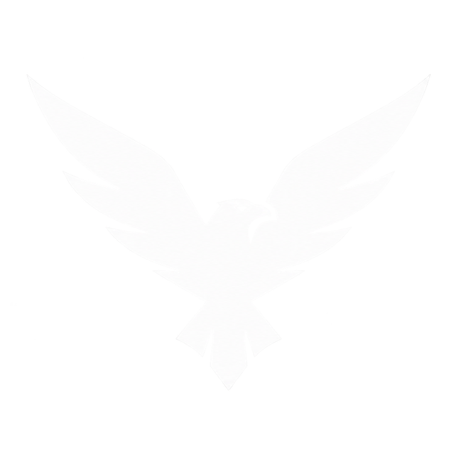

<p align="center">
  
</p>

<h1 align="center">Corvus GCS (CGCS)</h1>

<p align="center">
  <em>A modern, offline-first Ground Control Station for PX4 autonomous aircraft — built for the field: a laptop, a telemetry radio, and no internet.</em>
</p>

<div align="center">
  <a href="https://www.python.org/" target="_blank"></a>
  
  <a href="https://github.com/ArduPilot/pymavlink" target="_blank"></a>
  
  <a href="https://px4.io/" target="_blank"></a>
  <br>
  <a href="https://git.unibw.de/l11bmabo/CorvusGCS" target="_blank"></a>
  <br>
  
</div>

<p align="center">
  Self-hosted GitLab: <a href="https://git.unibw.de/l11bmabo/CorvusGCS">git.unibw.de/l11bmabo/CorvusGCS</a>
</p>

<details>
<summary><strong>Version note</strong> (why there is no version badge)</summary>

The version is intentionally **not** shown as a badge. The repository is hosted on a
self-hosted GitLab at `git.unibw.de` whose project API is not publicly readable, so a
dynamic shields.io version badge would render as an error rather than a number.
The canonical version string lives in the [`VERSION`](VERSION) file at the repo root
and is served live by the running app at `GET /api/version`. No version literal is
ever typed into this README.

</details>

<p align="center">
  
</p>

---

## Contents

- [What is Corvus GCS?](#what-is-corvus-gcs)
- [Screenshots & imagery](#screenshots--imagery)
- [Quick start](#quick-start)
- [Connecting to a drone](#connecting-to-a-drone)
- [Plugins — Vibration Monitor](#plugins--vibration-monitor)
- [Setup — Parameters, Calibration, Autotune](#setup--parameters-calibration-autotune)
- [Architecture](#architecture)
- [API endpoints](#api-endpoints)
- [Console commands](#console-commands)
- [Color system](#color-system)
- [Version control](#version-control)
- [PX4 compatibility](#px4-compatibility)
- [About / Origins](#about--origins)

---

## What is Corvus GCS?

Corvus GCS (CGCS) is a modern, **offline-capable Ground Control Station for
PX4-based autonomous aircraft**. It is a Python backend plus a web frontend,
wrapped into a single standalone desktop app — designed first for the person
standing next to an aircraft on a flight line, not for a desk.

The interface is **dark and operator-oriented**. The visual center is a **large
satellite map** that tracks the vehicle in real time. Overlaid on the map is a
**floating flight-instrument HUD** — a compass, an attitude indicator, and the
telemetry numbers that matter while you fly, always visible. On the right side,
a **collapsible engineering workspace** holds the tools you reach for between
flights: a **MAVLink console**, an **SSH terminal**, and a **plugin slot** for
specialist views.

From one window you can:

- **Fly** — live HUD, map, attitude, GPS, and body angular rates pushed from the
  autopilot over Server-Sent Events (the frontend never polls).
- **Connect** — serial, UDP, or TCP telemetry radios, with a live serial-port
  picker and sensible defaults for the Holybro SiK Radio V3.
- **Tune parameters** — a lazy, armed-safe parameter editor; the full set is
  fetched only when you open it.
- **Calibrate sensors** — one-tap compass, gyro, accelerometer, level-horizon,
  airspeed, and baro calibration, with live PX4 step guidance.
- **Autotune** — PX4 rate + attitude autotune per axis (roll / pitch / yaw / all),
  with live progress and graphs.
- **Diagnose vibration** — a Vibration Monitor plugin with a live Plotly graph of
  the PX4 `VIBRATION` message and cumulative clipping counters.
- **Reach the companion** — an SSH terminal for an onboard companion computer,
  over the same link.
- **Extend** — a plugin system (the **FUTURE** tab) where new specialist views plug
  in without touching the core.

### The field-use case

The driving constraint is the field: a laptop with **no internet**, a
**serial/UDP/TCP telemetry radio**, and a **clean shutdown between flights**.
Corvus GCS is built around that:

- The core ground station — telemetry, HUD, parameters, calibration, autotune,
  and the vibration monitor — runs **fully offline**. Plotly is **vendored
  locally** at `src/vendor/plotly-basic.min.js`, so graphs render with no
  connection.
- On a serial link it automatically applies conservative MAVLink stream rates so
  a 57 kbps radio isn't saturated, uses a longer heartbeat timeout (10 s), and
  reconnects with backoff if the link drops.
- The app **shuts down cleanly every time**: every child process is terminated
  (`SIGTERM` → timeout → `SIGKILL`), every daemon thread is joined, and file
  handles are flushed and closed — no zombies, no leaked sockets, no unflushed
  logs. The field laptop is rebooted between flights, and the app must disappear
  perfectly on `SIGINT` / `SIGTERM` / `atexit`.

> **Map tiles, fonts & icons (honest caveat):** the frontend currently loads
> MapLibre GL JS, Lucide icons, and Google Fonts from CDNs, so the satellite
> map and icons need an internet connection (or a local cache). An offline
> **MBTiles (SQLite) tile-cache store** is already implemented in
> `corvus/tile_cache.py` and tested, but is not yet wired into the map. Everything
> else works offline.

---

## Screenshots & imagery

<p align="center">
  
</p>

<p align="center"><em>The operator interface: dark, map-centered, with the floating HUD and the collapsible right-side engineering workspace (MAVLink console, SSH, plugin slot).</em></p>

<p align="center">
  
</p>

<p align="center"><em>Corvus GCS project logo.</em></p>

Drop additional screenshots into `assets/` and wire them in here. Keep image
paths relative (`assets/...`) so they render on both GitLab and GitHub.

---

## Quick start

### Requirements

- **Python 3.10+**
- **pymavlink** — MAVLink communication
- **paramiko** — SSH access
- **pyserial** — serial connections
- A modern browser with WebGL support (Chromium, Firefox, Edge)

```bash
pip install pymavlink paramiko pyserial
```

### Standalone desktop app (recommended)

```bash
# one command — creates conda env, installs deps, launches standalone window
./run.sh
```

This builds the conda environment from `environment.yml` and launches
`corvus/app.py` — a PyQt6 + QtWebEngine standalone window. No browser needed.
Chromium rendering flags handle GBM/Vulkan fallback automatically.

```bash
# custom MAVLink connection
./run.sh 8000 serial:/dev/ttyUSB0:57600
```

To launch again later without rebuilding the env, use `launch.sh`:

```bash
# launch in the existing conda env (no rebuild)
./launch.sh
```

### Browser mode (development)

```bash
# start only the backend server, open in browser manually
python3 serve.py
# -> http://localhost:8000/
```

### AppImage (Linux x86_64)

A single self-contained `.AppImage` that runs on a clean Ubuntu/Debian x86_64
install with no system Python or Qt needed — the easiest way to ship the app to
the offline field laptop. The build host needs Ubuntu/Debian x86_64, `python3`
(3.10+), `pip`, `wget` or `curl`, and roughly 1 GB of free disk for the build
cache. No conda required.

```bash
# one command — builds a self-contained Linux x86_64 AppImage
./build-appimage.sh
```

The script writes `Corvus_GCS-<version>-x86_64.AppImage` to the repo root, where
`<version>` is read from the `VERSION` file (see [Version control](#version-control)).
On the field laptop:

```bash
chmod +x Corvus_GCS-*-x86_64.AppImage
./Corvus_GCS-*-x86_64.AppImage
# optional MAVLink connection:
./Corvus_GCS-*-x86_64.AppImage 8000 serial:/dev/ttyUSB0:57600
```

The first run downloads `appimagetool` and the Python wheels (PyQt6 /
QtWebEngine, pymavlink, paramiko, pyserial); `appimagetool` is cached under
`build/` for fast re-runs. The AppImage bundles the app version from `VERSION`,
so to release a new version you only bump `VERSION` and rebuild. Build artifacts
(`build/`, `*.AppImage`) are gitignored.

---

## Connecting to a drone

### PX4 SITL (simulated)

If PX4 SITL is running (default UDP 14540), Corvus GCS connects automatically on
startup and starts receiving live telemetry:

```bash
# in PX4-Autopilot directory:
make px4_sitl
# SITL broadcasts MAVLink to 127.0.0.1:14540
```

### Real autopilot

```bash
# serial connection (USB telemetry radio)
python3 serve.py 8000 serial:/dev/ttyUSB0:57600

# UDP connection (WiFi telemetry)
python3 serve.py 8000 udp:192.168.2.10:14550
```

For field use, the recommended way to connect is the **LINK** tab in the
right-side panel rather than a command-line connection string. The operator picks
a serial port from a dropdown (populated live from the backend), chooses a baud
(57600 by default, labeled for the SiK Radio V3), or enters a custom UDP/TCP
connection string such as `udp:0.0.0.0:14540` for PX4 SITL.

#### Holybro SiK Telemetry Radio V3

A USB serial radio. On Linux it enumerates as two devices, e.g.
`/dev/ttyUSB0` and `/dev/ttyUSB1`; the lower-numbered one is the MAVLink data
port.

| Setting | Value |
|---------|-------|
| Device path | `/dev/ttyUSB0` (the lower of the two `ttyUSB` devices) |
| Baud rate | 57600 (factory default) |
| Connection string | `serial:/dev/ttyUSB0:57600` |

On serial links Corvus GCS automatically applies conservative MAVLink stream
rates so the 57 kbps radio link is not saturated, uses a longer heartbeat
timeout (10 s), and reconnects with backoff if the link drops.

### Connection states

| State | Indicator |
|-------|-----------|
| Connecting | Yellow dot |
| Connected | Green dot |
| Disconnected | Gray/red dot |
| Reconnecting | Yellow dot, last error shown |
| Armed | Green "ARMED" |
| Disarmed | Gray "DISARMED" |

---

## Plugins — Vibration Monitor

The **FUTURE** tab in the right-side panel is the extension point of Corvus GCS.
It shows a grid of plugin cards; clicking a card opens that plugin's view with a
back button, and opening another plugin first closes the current one so its
teardown runs exactly once (no listener leaks). The first shipped plugin is the
**Vibration Monitor**.

### Vibration Monitor

A live Plotly line graph of the PX4 `VIBRATION` message, plus a stats row of
cumulative accelerometer-clipping counters (3 counters). When the plugin opens
it asks PX4 to stream `VIBRATION` at ~10 Hz **on demand**; closing the plugin
restores PX4's default rate. High-rate vibration data flows only while someone is
watching, so the serial link stays uncongested the rest of the time — the lean,
field-first pattern used throughout Corvus.

The graph shows three traces:

| Trace | `VIBRATION` field | Color | Meaning |
|-------|-------------------|-------|---------|
| Gyro coning | `vibration_x` | Blue | Gyro delta-angle coning metric |
| Gyro HF vibration | `vibration_y` | Yellow | Gyro high-frequency vibration |
| Accel HF vibration | `vibration_z` | Red | Accelerometer high-frequency vibration — the main mechanical-health indicator |

**PX4-specific semantics** (verified from PX4 source
`src/modules/mavlink/streams/VIBRATION.hpp`): PX4 repurposes the three standard
MAVLink `VIBRATION` fields — `vibration_x` is a gyro delta-angle coning metric,
`vibration_y` is gyro high-frequency vibration, and `vibration_z` is
accelerometer high-frequency vibration. A rising **accel-HF (red)** trace means
more mechanical vibration — suspect motor imbalance, a loose or chipped prop, or
worn bearings. Operators should read the red trace first as the
mechanical-health indicator.

On-demand streaming uses `MAV_CMD_SET_MESSAGE_INTERVAL`, PX4's standard
per-message rate control (works on v1.16–v1.18). Plotly is **vendored locally**
at `src/vendor/plotly-basic.min.js`, so the graph renders with no internet
connection — matching the offline field-use requirement.

---

## Setup — Parameters, Calibration, Autotune

The Setup page (left nav) holds the parameter editor and the
calibration / autotune tiles. All three features are **lazy** and
**armed-safe**: nothing is fetched until the operator opens a tile, and every
parameter write, calibration, and autotune is refused while the vehicle is armed.

### Parameters

Parameters are downloaded **lazily** — only when the operator opens the
**Parameters** tile. Until then Corvus streams only the telemetry needed to fly
(GPS, attitude, etc.), keeping the GCS lean and fast to ready-for-flight. The
download shows a live progress indicator, and the editor is usable only after
the full parameter set has arrived (the operator must wait for completion). The
editor lets the operator change any parameter; writes go through `PARAM_SET` and
are confirmed by a `PARAM_VALUE` echo. Parameter writes are **refused while
armed** (safety).

### Sensor calibration

Setup → **Calibration** tile: one-tap sensor calibration for:

- Compass (magnetometer)
- Gyroscope
- Accelerometer
- Level Horizon
- Airspeed
- Baro

Calibration is **refused while armed**. PX4 also rejects calibration when armed,
but Corvus refuses client-side first. During interactive calibrations (compass
rotation, accelerometer positions) PX4 streams step-by-step guidance as
`STATUSTEXT`, which appears in the MAVLink console and the warnings popover.

### Autotune

Setup → **Calibration** tile → **POD Tuning** subsection: PX4 autotune via
`MAV_CMD_DO_AUTOTUNE_ENABLE`. The operator picks an axis — **Roll, Pitch, Yaw, or
All**. Autotune tunes the rate and attitude controllers together (PX4 module
`mc_autotune_attitude_control`). Autotune is **refused while armed**, and tuning
progress streams as `STATUSTEXT`.

> **No velocity-controller autotune in PX4.** PX4 provides only rate + attitude
> autotune — there is no velocity-controller autotune. The UI marks the velocity
> controller as unsupported rather than sending a command the firmware does not
> understand.

The autotune graphs (roll rate, roll attitude, horizontal velocity) use Plotly.
These traces come from existing telemetry that streams continuously (not
on-demand like vibration): roll rate from the `ATTITUDE` body rate `rollspeed`,
roll attitude from `ATTITUDE` roll, and horizontal velocity from `VFR_HUD`
groundspeed / `GLOBAL_POSITION_INT`.

Body angular rates (`rollspeed`, `pitchspeed`, `yawspeed`, in deg/s) are part of
the telemetry state.

---

## Architecture

```
serve.py                      # browser-mode entry point (HTTP server only)
run.sh                        # standalone launcher: conda env + PyQt6/QtWebEngine
launch.sh                     # launch in an existing conda env (no rebuild)
build-appimage.sh             # build a self-contained Linux x86_64 AppImage
environment.yml               # conda env spec (PyQt6, pymavlink, paramiko, pyserial)
pyproject.toml                # tooling/pytest config (version comes from VERSION, not here)
├── corvus/                   # Python backend package
│   ├── app.py                # standalone PyQt6 + QtWebEngine app wrapper
│   ├── version.py            # reads VERSION (single source of truth)
│   ├── state_store.py        # thread-safe Vehicle State Store
│   ├── mavlink_bridge.py     # pymavlink connection + message parsing
│   ├── ssh_bridge.py         # paramiko SSH sessions
│   ├── tile_cache.py         # offline MBTiles (SQLite) tile-cache store
│   └── server.py             # HTTP + SSE + API server
├── src/                      # web frontend
│   ├── index.html
│   ├── css/
│   │   ├── main.css          # layout + semantic palette
│   │   └── components.css     # reusable component styles (.btn system)
│   ├── js/
│   │   ├── telemetry.js          # SSE client for real telemetry
│   │   ├── notification_dedupe.js # dedupes STATUSTEXT / warnings
│   │   ├── topbar.js         # top bar: arm/takeoff/land/RTL, mode, status
│   │   ├── map.js            # MapLibre map, vehicle tracking
│   │   ├── instruments.js    # compass + attitude indicator (HUD)
│   │   ├── panel.js          # MAVLink console + SSH
│   │   ├── link.js           # LINK tab (serial/UDP/TCP connect)
│   │   ├── plugins.js        # FUTURE-tab plugin system (extension point)
│   │   ├── plugin-vibration.js # Vibration Monitor plugin
│   │   ├── setup.js          # Setup page orchestrator (tile grid)
│   │   ├── setup-calibration.js # calibration + autotune sub-page
│   │   ├── setup-parameters.js  # parameter editor sub-page
│   │   ├── setup-shared.js   # shared Setup-page helpers
│   │   ├── sidenav.js        # left navigation
│   │   ├── ui.js             # reusable UI component helpers
│   │   └── app.js            # top bar wiring + flight actions
│   └── vendor/
│       └── plotly-basic.min.js  # vendored Plotly (offline graphs)
├── assets/                   # logo + screenshots
└── VERSION                   # single-source version string
```

### Data flow

```
PX4 Autopilot → MAVLink (UDP/Serial) → pymavlink bridge → Vehicle State Store
                                                                    ↓
Web browser ← SSE (/api/telemetry) ← HTTP server ← (thread-safe)
```

Telemetry is pushed from backend to frontend via **Server-Sent Events** (SSE).
The frontend never polls.

---

## API endpoints

| Method | Path | Description |
|--------|------|-------------|
| GET | `/api/version` | GCS version + PX4 profile |
| GET | `/api/state` | Current vehicle state (JSON) |
| GET | `/api/telemetry` | SSE stream of vehicle state |
| GET | `/api/console/stream` | SSE stream of MAVLink messages |
| POST | `/api/console/command` | Send MAVLink command |
| POST | `/api/mavlink/connect` | Reconnect with different connection string |
| GET | `/api/mavlink/serial-ports` | List available serial ports → `{"ports": [{"device", "description", "hwid"}, ...]}` |
| POST | `/api/mavlink/arm` | Arm/disarm vehicle |
| POST | `/api/mavlink/mode` | Set flight mode |
| POST | `/api/params/download` | Start a full parameter download (lazy) |
| GET | `/api/params` | Parameter cache + download status (params only sent when complete — lean) |
| GET | `/api/params/progress` | SSE stream of parameter download progress |
| POST | `/api/params/set` | Write a parameter (refused while armed) |
| POST | `/api/calibrate` | Run a sensor calibration `{type: gyro\|compass\|baro\|accel\|level\|airspeed}` (refused while armed) |
| POST | `/api/autotune` | Run PX4 autotune `{axis: roll\|pitch\|yaw\|all}` (refused while armed) |
| POST | `/api/vibration/stream` | Request high-rate VIBRATION streaming on demand `{enabled, rate_hz}` (lean: restore default on close) |
| POST | `/api/ssh/connect` | Open SSH session |
| POST | `/api/ssh/send` | Send input to SSH shell |
| POST | `/api/ssh/disconnect` | Close SSH session |
| GET | `/api/ssh/stream` | SSE stream of SSH output |
| GET | `/api/ssh/sessions` | List SSH sessions |

---

## Console commands

In the MAVLink console, type:

```
help        — list commands
arm         — arm the vehicle
disarm      — disarm the vehicle
mode AUTO   — set flight mode
takeoff 10  — takeoff to 10m
land        — land at current position
rtl         — return to launch
```

---

## Color system

The UI follows a strict semantic palette (defined in `src/css/main.css`):

| Color | Hex | Meaning |
|-------|-----|---------|
| Green | `#45D483` | healthy / connected / armed |
| Blue | `#4CC9FF` | flight / navigation / mission |
| Forest Green | `#3DA876` | UI interaction accent (not status) |
| Yellow | `#F5C842` | warning |
| Red | `#FF514D` | critical / error |

---

## Version control

The version string lives in [`VERSION`](VERSION) at the repo root.
`corvus/version.py` reads it at import time. The HTTP server exposes it at
`GET /api/version`. No component hardcodes a version literal — a single bump on
release propagates everywhere automatically. See `AGENTS.md` for the full version
policy. This README is a *consumer* of the version, never a source: it never
types a version number.

---

## PX4 compatibility

Primary target: **PX4 v1.16, v1.17, v1.18.** The MAVLink bridge detects the
firmware via `AUTOPILOT_VERSION`, loads the matching parameter schema, and falls
back gracefully (never crashes) when a parameter is absent. It refuses to send a
`MAV_CMD` or write a parameter the connected firmware does not understand. The
three target versions are the regression set: any parameter / mode / flight-plan
change is checked against v1.16, v1.17, and v1.18 before it is accepted. Older
firmwares (v1.12–v1.15) are supported on a best-effort basis via fallback tables
but are not the focus. See `AGENTS.md` for the full compatibility policy.

---

## About / Origins

Corvus GCS is developed at the **Universität der Bundeswehr München** (University
of the German Federal Armed Forces, Munich). It is an AI-assisted project —
"vibe coded" with human direction — and is built for real field use, not just
for demos.

<p align="center">
  
</p>

**License:** no license file ships with the repository yet — the badge above
reads *TBD*. Add a `LICENSE` file at the repo root and update this section when
licensing is finalized. The project source currently lives on the university's
self-hosted GitLab at `git.unibw.de`.

---

<sub>Developed at the Universität der Bundeswehr München · Corvus GCS (CGCS) ·
version from <a href="VERSION"><code>VERSION</code></a>, served live at <code>GET /api/version</code>.</sub>
