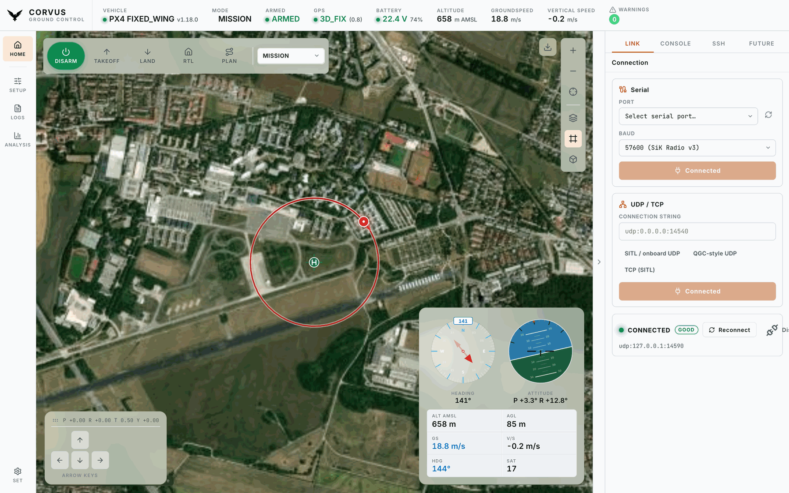
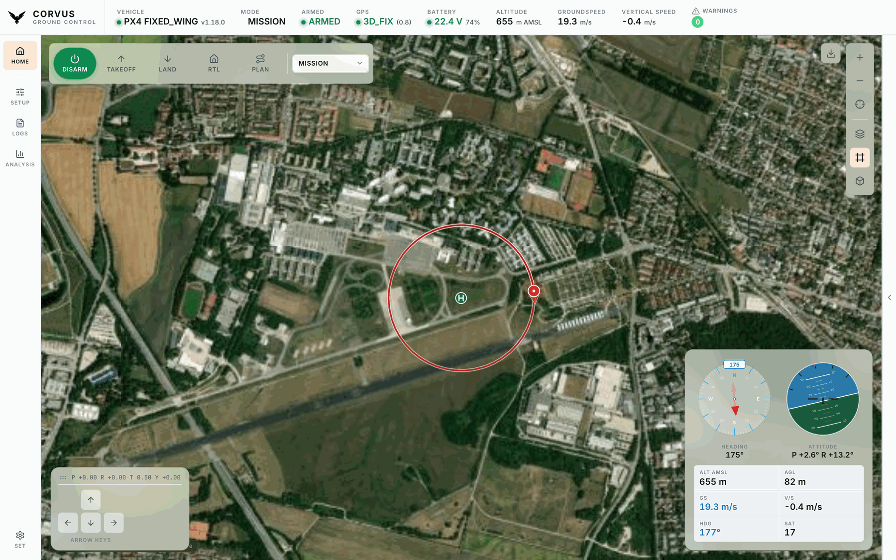
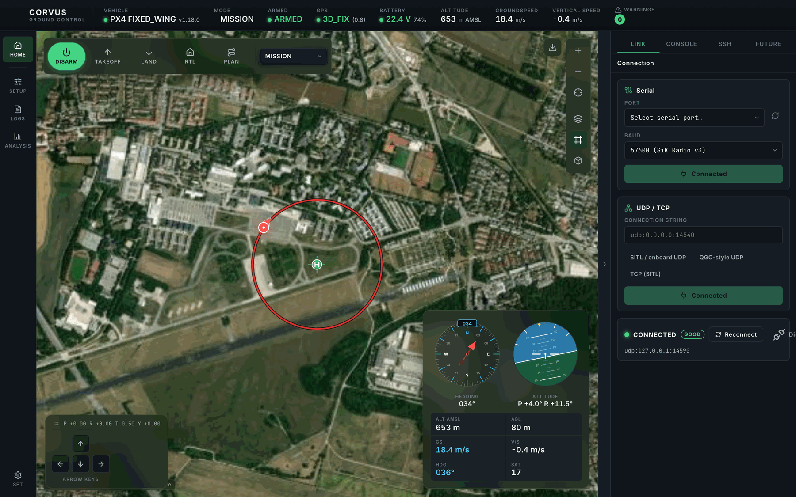
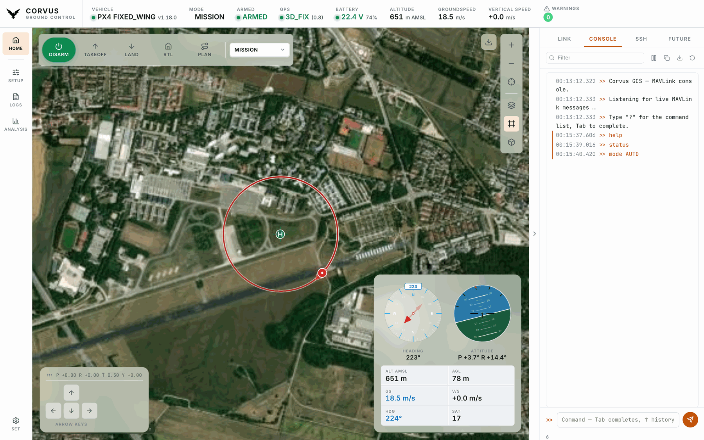
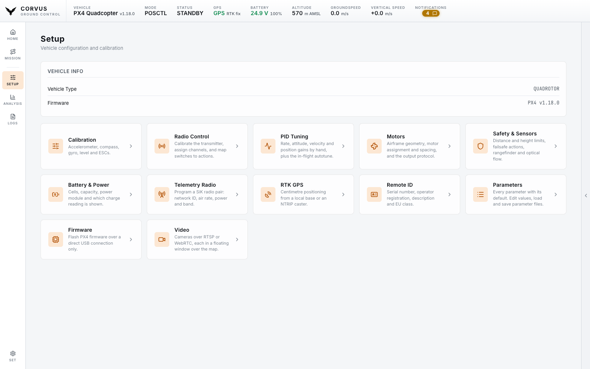
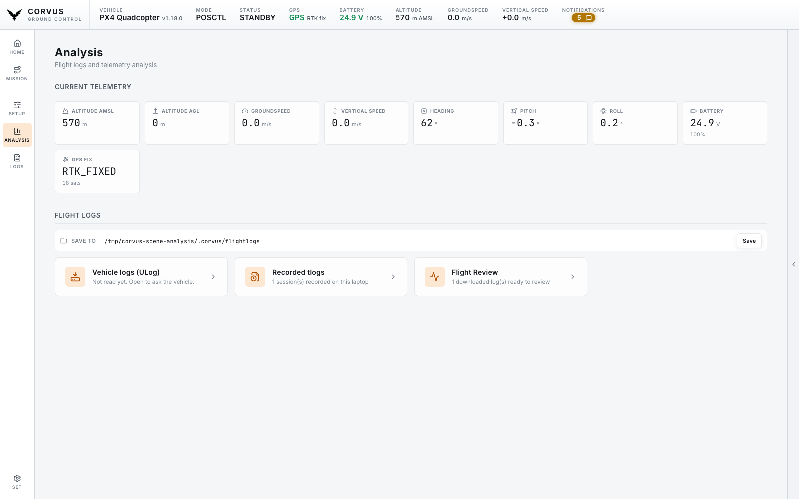

<p align="center">
  <picture>
    <source media="(prefers-color-scheme: dark)" srcset="assets/CorvusGCS_logo.png">
    
  </picture>
</p>

<h1 align="center">Corvus GCS (CGCS)</h1>

<p align="center">
  <em>A modern, offline-first Ground Control Station for PX4 autonomous aircraft —<br>
  built for the field: a laptop, a telemetry radio, and no internet.<br>
  Loads only what it needs, so it is <strong>ready to fly in seconds, not minutes</strong>.</em>
</p>

<div align="center">
  <!-- corvus:version-badge -->
  
  
  <a href="https://www.python.org/" target="_blank"></a>
  
  <a href="https://github.com/ArduPilot/pymavlink" target="_blank"></a>
  
  <a href="https://px4.io/" target="_blank"></a>
  <br>
  
  
  
  
  
  <br>
  
  
  
  
  
  
  <a href="LICENSE.md"></a>
</div>

<!--
  The version badge above shows a real number, and it cannot go stale: the
  pre-commit hook that bumps VERSION rewrites that badge from it in the same
  step, so the two are updated together or not at all. Do not hand-edit the
  number, and do not remove the corvus:version-badge marker — the hook finds
  the line by it. VERSION remains the single source of truth; the badge is a
  generated view of it, not a second place to maintain.
-->

<p align="center">
  
</p>

<p align="center"><em>A PX4 fixed-wing flying a circuit — live map, the floating flight HUD, and the engineering workspace on the right.</em></p>

---

## Contents

- [What is Corvus GCS?](#what-is-corvus-gcs)
  - [Fast to ready-for-flight](#fast-to-ready-for-flight)
- [Why this project exists](#why-this-project-exists)
- [Features](#features)
- [Screenshots](#screenshots)
- [Install & run](#install--run)
- [Connect to your aircraft](#connect-to-your-aircraft)
- [Using Corvus](#using-corvus)
- [Console commands](#console-commands)
- [PX4 compatibility](#px4-compatibility)
- [Get involved](#get-involved)
- [About / Origins](#about--origins)
- [License](#license)

---

## What is Corvus GCS?

**Corvus GCS is a ground control station for PX4-based autonomous aircraft.**
It is the software you have open on a laptop while an aircraft is in the air:
it shows you where the vehicle is, what it is doing, and lets you talk to it —
over a serial telemetry radio, UDP, or TCP.

It is a Python backend plus a web frontend, wrapped into a single standalone
desktop application. There is no server to deploy and no browser tab to
manage: one window, one process, one clean shutdown.

**What it is used for**

- **Flying and monitoring** — a large live map with the vehicle, its home point
  and its flown track, plus a floating flight-instrument HUD (compass, attitude
  indicator, altitude, speeds, GPS) that stays visible while you fly.
- **Preparing an aircraft** — motor wiring and ESC protocol on a drawing of your
  own airframe, parameters, sensor and ESC calibration, PX4 autotune, and
  firmware flashing, all from the same window.
- **Understanding a flight afterwards** — download the vehicle's ULog files over
  MAVLink and analyse them locally in the built-in Flight Review.
- **Working in the field** — the interface loads nothing from the internet, map
  tiles are cached into a local offline store, and named map regions can be
  downloaded ahead of time. A laptop that has never seen a network still gets
  correct icons, fonts, graphs and maps.

### Fast to ready-for-flight

> **This is the difference you notice first.** Most ground control stations pull
> the **entire** parameter set off the autopilot the moment they connect —
> a thousand-plus parameters, in full, before the interface is usable. Over a
> 57 kbps telemetry radio that is a wait measured in minutes, every single time
> you power up, and a lossy link can stall or restart the whole transfer.
>
> **Corvus loads only as much as it actually needs.** On connect it streams
> nothing but the telemetry required to fly — position, attitude, GPS, battery,
> link health. The full parameter set is fetched **lazily**: only when you open
> the Parameters page, because that is the only moment it is needed. Nothing
> else in the application waits on it.
>
> The practical effect is that Corvus is **ready to fly in seconds rather than
> minutes**, and it stays reliable on exactly the marginal links where a
> full-set download is most likely to fail. On the flight line, where you are
> standing next to a powered aircraft waiting to launch, that is the property
> that matters most — and when you *do* need parameters, they are one click
> away, with a live progress indicator and an editor that refuses writes while
> armed.

**Who it is for.** Anyone operating a PX4 aircraft who wants a ground station
that is small enough to read end-to-end, honest about what it is doing, and
built around a field laptop rather than a desk. It is a working tool, not a
demo — and because the codebase stays readable rather than sprawling, it is
also a reasonable starting point if you want to build your own ground-station
features on top.

The interface is **operator-oriented**: a map-centred layout, six colour themes
(two light, four dark), one slider that scales the whole interface from 80 % to
150 %, and a collapsible right-hand workspace holding the MAVLink console, an
SSH terminal, and a plugin slot for specialist views.

---

## Why this project exists

In my day-to-day work as a PhD researcher there is very little room for
AI-assisted, "vibe-coded" development — the setting simply does not allow for
it. That method is nonetheless becoming a real part of how software gets built,
and the only honest way to find out where it works, where it breaks, and how to
direct it well is to use it seriously on something non-trivial.

**Corvus GCS is that something.** It is a test and learning project: a place to
build up practical experience with AI-assisted development on a codebase large
enough to have real architecture, real edge cases, and real consequences when a
design decision is wrong. Every line here was written that way — hence the
badge — but under continuous human direction, review, and a test suite that is
roughly four fifths the size of the application itself.

The result is not a throwaway. The scope was chosen precisely because it is
useful: a PX4 ground station is a genuine tool with genuine field requirements,
so the project stays honest. It can be used as it is, adapted for a different
airframe or workflow, taken apart as a reference for MAVLink, offline tiling or
SSE-based telemetry, or simply read as an example of what this way of working
produces at scale.

If you are curious about AI-assisted development on real systems, or you just
need a ground station, both readings of this repository are intended.

---

## Features

Everything here is **built and working today**.

| | What you get | |
|---|---|:--:|
| ⚡ **Ready fast** | On connect Corvus loads only flight telemetry. Parameters are fetched when *you* ask for them — so you are flying in seconds, not minutes | ✅ |
| 🛩️ **Fly** | Live map, floating flight HUD, arm / takeoff / land / RTL, flight-mode selection, on-screen joystick and arrow-key control | ✅ |
| 🗺️ **Navigate** | 4 map services with 12 layers, vehicle heading, home point, the flown track, and click-the-map to fly there or move home | ✅ |
| 📴 **Work offline** | Nothing loads from the internet. Download named map areas in advance and the whole app keeps working with no connection | ✅ |
| 📡 **Connect** | Serial, UDP and TCP, a live port picker, saved recent connections, link-quality display and automatic reconnect | ✅ |
| 🔧 **Set up** | Airframe drawn to scale — click a motor to wire, position or spin-test it; ESC protocol; parameter editor with import / export; guided sensor calibration, ESC calibration, autotune, and PX4 firmware flashing | ✅ |
| 🛡️ **Set limits** | Maximum distance and height, the return-to-launch profile, and a failsafe action for every loss PX4 can detect — plus a distance sensor or optical-flow camera brought up by one switch, driver and estimator together | ✅ |
| 📊 **Review flights** | Download the vehicle's logs, record the live stream, and analyse both in the built-in Flight Review — all on your own machine | ✅ |
| 🖥️ **Tools** | MAVLink console, SSH terminal to an onboard companion computer, and a plugin slot (vibration monitor included) | ✅ |
| 🎨 **Personalise** | Six colour themes, interface scale from 80 % to 150 %, your own logo — all saved between sessions | ✅ |
| 💻 **Just run it** | One standalone app for macOS and Linux. No install, no server, no browser, clean shutdown every time | ✅ |

**Safety is built in:** parameter writes, motor tests, firmware flashing and ESC calibration
are all refused while the aircraft is armed, and the on-screen controls never
arm, change mode, or override a failsafe. A refused write is never shown as
applied — the control snaps back to the value the aircraft still holds.

---

## Screenshots

<p align="center">
  
</p>

<p align="center"><em><strong>The map is the interface.</strong> Collapse the side panel and the whole
window becomes the operational picture — vehicle, heading, home point and the flown track, with the
HUD floating wherever you put it.</em></p>

<p align="center">
  
</p>

<p align="center"><em><strong>Six themes, two light and four dark.</strong> Switching is instant — no
reload, no flash.</em></p>

<p align="center">
  
</p>

<p align="center"><em><strong>The side workspace.</strong> A MAVLink console, an SSH terminal for the
companion computer, and a plugin slot — beside the map rather than instead of it.</em></p>

<p align="center">
  
</p>

<p align="center"><em><strong>Setup.</strong> Motors, safety limits and failsafes, parameters, sensor and
ESC calibration, autotune and firmware — the things you do between flights, in one place.</em></p>

<p align="center">
  
</p>

<p align="center"><em><strong>Analysis.</strong> Live values, log download from the aircraft, and the
built-in Flight Review. Logs are read locally and never leave your machine.</em></p>

<sub>Every image path above is relative (`assets/...`) so it renders on any Git host.
The logo ships in two cuts — white artwork for dark backgrounds, black for light ones — because a
transparent-background logo is invisible on the wrong surface. Each usage is a `<picture>` that
serves the right cut per theme.</sub>

---

## Install & run

### The easy way — a ready-made app

Download the build for your machine and run it. Nothing else is needed: Python,
Qt and every dependency are already inside.

| Platform | File | First launch |
|---|---|---|
| **macOS** (Apple Silicon / Intel) | `Corvus_GCS-<version>-macOS-<arch>.dmg` | Drag to `/Applications`. The build is not notarized, so the first time use **right-click → Open**. |
| **Linux** (x86_64) | `Corvus_GCS-<version>-x86_64.AppImage` | `chmod +x` it, then run it. Works on a clean Ubuntu/Debian with no system Python or Qt. |

To pass a port and a connection at startup, launch it from a terminal:

```bash
"/Applications/Corvus GCS.app/Contents/MacOS/corvus-gcs" 8000 serial:/dev/tty.usbserial-0001:57600
```

### From source

Requires **Python 3.10+**. One command creates the environment and opens the app:

```bash
./run.sh
```

```bash
./launch.sh    # start again later, without rebuilding the environment
./run.sh 8000 serial:/dev/ttyUSB0:57600    # with a connection
```

For development you can also run just the backend and open it in a browser:

```bash
python3 serve.py        # -> http://localhost:8000/
```

<details>
<summary>Building the standalone apps yourself</summary>

<br>

```bash
./build.sh          # Linux -> AppImage,  macOS -> .app
./build.sh --dmg    # macOS: also produce a .dmg
```

`build.sh` dispatches to the platform script for the host you are on and never
pretends to cross-build. Both produce a self-contained bundle carrying a
relocatable CPython, Qt and every runtime dependency, named from the
[`VERSION`](VERSION) file.

**Linux** needs Ubuntu/Debian x86_64, `python3` (3.10+), `pip`, `wget` or
`curl`, and ~1 GB of free disk. The first run downloads `appimagetool` and the
Python wheels and caches them under `build/`.

**macOS** needs the Xcode command line tools (`xcode-select --install`) and a
**framework** CPython 3.10+ (Homebrew's `python@3.11` or a python.org install).
A conda interpreter cannot be relocated into a bundle and is rejected with a
clear error. The bundle is ad-hoc signed; set
`CODESIGN_IDENTITY="Developer ID Application: ..."` to sign it properly.

Build artifacts (`build/`, `dist/`, `*.AppImage`, `*.dmg`) are gitignored.
CI runs the same `./build.sh` — see
[`.github/workflows/build.yml`](.github/workflows/build.yml) and
[`.gitlab-ci.yml`](.gitlab-ci.yml).

</details>

---

## Connect to your aircraft

Open the **LINK** tab in the side panel and pick how you are connected. This is
the normal way to connect — a command-line connection string is only for
scripting.

- **Serial** — choose the port from the dropdown (it is re-read every time you
  open the tab, so a radio plugged in after launch just appears) and a baud
  rate. 57600 is the default, labelled for the Holybro SiK Radio V3.
- **UDP / TCP** — type a connection string such as `udp:0.0.0.0:14540`, or use
  one of the presets for the endpoints PX4 publishes. Presets fill the field
  rather than connecting outright, so you can edit before you commit.
- **Recent connections** are saved and one click to reuse, kept exact — a
  `:57600` and a `:115200` link to the same port are different entries, because
  collapsing them would silently reconnect at the wrong baud.
- **Disconnect** frees the radio without quitting the app, and works *during* a
  connection attempt too — which is exactly when a retry loop needs stopping.

Next to the connection state you get **link quality**, not just "connected":
signal strength, heartbeat regularity and receive errors. Connected tells you
the socket is up; link quality tells you whether it is worth flying on.

| State | Indicator |
|---|---|
| Connecting / reconnecting | Yellow dot (last error shown) |
| Connected | Green dot |
| Disconnected | Grey dot |
| Armed / disarmed | Green **ARMED** / grey **DISARMED** |

<details>
<summary>Holybro SiK Telemetry Radio V3, and simulation</summary>

<br>

On Linux the radio enumerates as **two** devices, e.g. `/dev/ttyUSB0` and
`/dev/ttyUSB1`. The **lower-numbered one** is the MAVLink data port.

| Setting | Value |
|---|---|
| Device path | `/dev/ttyUSB0` (the lower of the two) |
| Baud rate | 57600 (factory default) |
| Connection string | `serial:/dev/ttyUSB0:57600` |

On a serial link Corvus automatically applies conservative MAVLink stream rates
so a 57 kbps radio is not saturated, allows a longer heartbeat timeout (10 s),
and reconnects with backoff if the link drops.

**PX4 SITL** broadcasts to UDP 14540, which Corvus connects to automatically on
startup:

```bash
make px4_sitl     # in the PX4-Autopilot directory
```

</details>

---

## Using Corvus

### The map and the flight HUD

The map is the centre of the app. Your aircraft is drawn with a **heading cone**
and a white separating ring so it stays visible over any imagery, the **home
point** is a landing-pad mark on the exact coordinate, and the **flown track**
trails behind you in red.

The track survives a link drop — only an actual vehicle reboot clears it, or the
small clear button in the map's corner. That way a dropout does not erase where
you have been.

**Click anywhere on the map** to open a menu: fly to that position, or move the
home point there.

The **flight HUD** — compass, attitude indicator, altitude, speeds, heading and
satellite count — floats over the map in a window you control. Grab it anywhere
that is not a button and move it, **pin** it so a stray gesture cannot shift it,
shrink it to a compact size, or collapse it away; double-click sends it back to
its corner. The on-screen control pad moves the same way.

Where you put either window stays put: across restarts, across a trip to Setup
or Options and back, and when the side workspace slides open — a window parked
against the right edge travels in with it rather than disappearing behind it.

### Offline maps

Corvus caches every map tile it fetches into a local store, so ground you have
already looked at keeps working with no connection.

To prepare for a field trip, use **Download offline map** on the map and select
an area. Downloads are **named**, listed, and drawn as outlines on the map, so
"what do I actually have offline?" is a question you can answer at a glance
instead of guessing from coordinates.

Panning onto ground you never downloaded stays fast: after a few failed
lookups Corvus stops trying for 30 seconds, so cached tiles render at full speed
and the rest simply stays blank rather than freezing the map. Walking back into
coverage recovers on its own.

### Setup — motors, safety, parameters, calibration, autotune, firmware

- **Motors** — your airframe, drawn. Every motor sits at its real distance from
  the centre of gravity with its number, its output and a spin-direction arrow,
  so "the front-left one" is something you point at instead of work out. The
  body behind them follows the airframe class: arms for a multirotor, a wing and
  tail for a plane, booms plus a wing for a quadplane, a rotor disc and tail
  boom for a helicopter, a chassis for a rover. A rotor that pushes rather than
  lifts — a VTOL's pusher, a plane's tractor — is drawn with a thrust arrow
  instead of a boom, read from its own axis parameters. PX4 stores no wingspan,
  so the outline is schematic and the page says so; only the motors are
  measured.
- Click a motor to select it, then set which output drives it — MAIN, AUX or
  DroneCAN, and which pin — along with its position and rotation. Picking a pin
  that already has a motor on it swaps the two, which is the one-click fix for
  crossed motors; picking one that drives a servo is refused by name rather than
  silently taken. A motor wired to nothing is flagged on the drawing. The
  airframe type and the motor count sit on the same card, next to the picture
  they change, and adding or removing a motor redraws it.
- **Motor test** — spin one motor on the bench to find out which one it is.
  **Remove the propellers first**: the button will not enable until you confirm
  you have, it is refused while armed, the throttle stops at half, and the
  duration is bounded on the *vehicle*, so the motor stops even if the link
  dies. Leaving the page stops a running motor.
- **Output protocol** — DShot150/300/600/1200, OneShot or a plain PWM rate per
  timer group, plus the PWM endpoints. Reading the whole page costs about a
  hundred parameters, not the full set, so it opens in a second, and only what
  the connected firmware actually reports is shown — the page is honest across
  PX4 versions rather than offering settings your board does not have. Every
  field is written back one at a time, confirmed by the aircraft, and the whole
  page is read-only while armed.
- **Safety & Sensors** — the envelope the aircraft is allowed to use, in one
  page: maximum distance and height from home and what happens at the limit,
  the return-to-launch profile (return and descend height, the climb cone, the
  loiter before landing), and a failsafe action for every loss PX4 can detect —
  RC, data link, position, battery, actuator — with the battery levels that
  trigger them.
- **Distance sensor and optical flow** — on the same page, because a ground
  lidar is what half those limits lean on. One switch brings a sensor up:
  Corvus starts the driver *and* tells the estimator to fuse it, which is the
  step usually missed — a rangefinder reading perfectly while the EKF ignores
  it looks exactly like a working sensor. Pick the model (Lightware,
  Lidar-Lite, Benewake, PMW3901 and the rest, or a sensor arriving over
  MAVLink), name the serial port if it needs one, and the few settings that are
  genuinely per-airframe — mounting offset, height limits, quality gates — stay
  underneath. The state line always names both halves, so a half-configured
  sensor cannot look finished.
- **Parameters** — the full set is downloaded only when you open this page (see
  [Fast to ready-for-flight](#fast-to-ready-for-flight)), with a live progress
  bar. Then you can edit any value; writes are confirmed by the aircraft and
  **refused while armed**. *Export* and *Import* write and read a readable JSON
  file with the airframe and date in the name.
- **Sensor calibration** — a guided wizard for compass, gyro, accelerometer,
  level horizon, airspeed and baro. The aircraft is drawn in the position PX4 is
  asking for, each orientation is ticked off as it completes, and a running
  calibration can be cancelled on the vehicle.
- **Motor / ESC calibration** — behind a safety confirmation, because motors
  spin at full PWM. **Remove the propellers first.** Refused while armed.
- **Autotune** — PX4 rate and attitude autotune per axis (roll, pitch, yaw, or
  all) with live progress and graphs.
- **Firmware** — flash PX4 firmware over a **direct USB connection only**.
  Refused over a telemetry radio or UDP/TCP, and refused while armed.

### Analysis — logs and Flight Review

- **Vehicle logs (ULog)** — browse the flight controller's SD card and download
  logs. Tick several and walk away: they are fetched one after another with a
  progress bar and a Cancel that works throughout. Files land as
  `log_<id>_<UTC date>.ulg`, still readable a month later.
- **Recorded tlogs** — the MAVLink stream Corvus recorded on this laptop, one
  file per flight session.
- **Flight Review** — pick a downloaded log and Corvus reduces it to the plots
  that answer *"was that flight healthy?"* — motors, clipping, EKF, battery —
  with findings above the plots and the aircraft's own messages below, filtered
  by severity. **A log that never came through Corvus can be opened too**, from
  anywhere on your machine. Everything is parsed locally; nothing is uploaded.

### The side workspace

A collapsible panel beside the map, so tools never replace the operational
picture.

- **MAVLink console** — your direct line to the airframe. Filter the live
  stream, and read severity off the colour rather than hunting through level
  buttons: errors red, warnings amber, success green, your own commands
  accented, shell replies blue. **Pause** freezes the view while still buffering
  behind it, so reading one message does not cost you the next fifty. Tab
  completes commands, `?` prints the whole command table, history is kept across
  launches, and Copy / Save hand you the visible lines for a bug report.
- **SSH** — a terminal into an onboard companion computer over the same link.
  Connections are **saved by name** with password or key-file authentication, so
  reconnecting is one click.
- **Plugins** — specialist views that plug in without touching the core. The
  **Vibration Monitor** ships with it: a live graph of the aircraft's vibration
  levels plus cumulative clipping counters.

### Settings

Reachable from **SET** at the bottom of the left rail. Everything applies
instantly and is saved.

- **Appearance** — six colour themes (two light, four dark), an interface-size
  slider from 80 % to 150 % that scales the entire app, and your own company
  logo in the top right.
- **Map** — which service (Esri, OpenStreetMap, Google, Bing) and which of its
  layers. Also switchable from the layer control on the map itself.
- **Controls** — two switches, **both off by default**, for the on-screen
  manual controls: a **virtual joystick** (throttle and yaw left, pitch and roll
  right) and an **arrow-key pad** that your keyboard's own arrow keys drive.
  They are input sources only — they never arm, change mode, or override a
  failsafe.
- **SSH connections** — add, connect and remove saved hosts.
- **Files** — where parameter exports, logs and downloads are written.
- **About** — version, the live connection summary, and **Credits** listing
  every bundled dependency and its licence.

---

## Console commands

In the MAVLink console, type:

```
help        — list commands
arm         — arm the vehicle
disarm      — disarm the vehicle
mode AUTO   — set flight mode
takeoff 10  — takeoff to 10 m
land        — land at current position
rtl         — return to launch
```

Tab completes, `↑` walks history, and `?` prints the full table — it works with
the link down, too.

---

## PX4 compatibility

Primary target: **PX4 v1.16, v1.17, v1.18.** Corvus detects the firmware version
on connect, loads the matching parameter schema, and degrades gracefully rather
than crashing when something is missing — it refuses to send a command or write
a parameter the connected firmware does not understand. All three versions are
checked before any parameter, mode or flight-plan change is accepted. Older
firmwares (v1.12–v1.15) work on a best-effort basis but are not the focus.

---

## Get involved

**Contributions, bug reports and feature wishes are very welcome.**

This project improves fastest through use. If you fly with it and something is
awkward, slow, or wrong, that is worth reporting — a short description of what
you expected and what happened is enough. The same goes for features: if your
workflow needs something Corvus does not do yet, say so. Wishes are not an
imposition here, they are the most useful input there is.

- **Found a bug?** Open an issue with the PX4 version, the connection type
  (serial / UDP / TCP), and what you were doing.
- **Want a feature?** Describe the operational problem rather than the solution
  — it usually leads somewhere better.
- **Want to contribute code?** Pull requests are welcome. `AGENTS.md` documents
  the architecture rules and conventions the codebase follows; keeping to them
  is all that is asked.
- **Just have a question?** Ask. Questions about the design decisions are
  particularly welcome — a lot of them are deliberate.

---

## About / Origins

Corvus GCS is developed with the **Universität der Bundeswehr München** (University
of the German Federal Armed Forces, Munich), in the context of the work at
**Chair LRT 1.1 of Prof. Dr. Matthias Gerdts**.

It is an **AI-assisted project** — vibe coded, under human direction and review —
and it is built for real field use rather than for demonstrations. See
[Why this project exists](#why-this-project-exists) for what that means in
practice and why the project is set up this way.

<p align="center">
  <picture>
    <source media="(prefers-color-scheme: dark)" srcset="assets/CorvusGCS_logo.png">
    
  </picture>
</p>

## License

Corvus GCS is released under the **[Sustainable Use License, Version 1.0](LICENSE.md)** —
a *fair-code* license: the source is open to read, modify and build on, but not
to resell.

In short, and without replacing the terms in [`LICENSE.md`](LICENSE.md):

- **You may** use and modify it for your own internal business purposes, and
  for non-commercial or personal use — flying your own aircraft, research,
  teaching, and building on it are all covered.
- **You may** pass it on, provided you do so free of charge and for
  non-commercial purposes, and that whoever receives it also receives these
  terms. If you modified it, say so prominently.
- **You may not** sell it, or offer it to third parties as a paid product or
  service.

Third-party components — pymavlink, paramiko, pyserial, PyQt6/Qt, MapLibre GL
JS, Plotly, Lucide — keep the licenses of their own authors. The full list, with
each component's license, is in the app under **[Settings > About >
Credits](#settings)**. The license file ships inside the AppImage and the macOS
app as well as in the repository, because the terms have to travel with the
software.

---

<p align="center">
  <sub>Developed with the Universität der Bundeswehr München · Corvus GCS (CGCS)</sub>
</p>

<p align="center">
  
</p>
