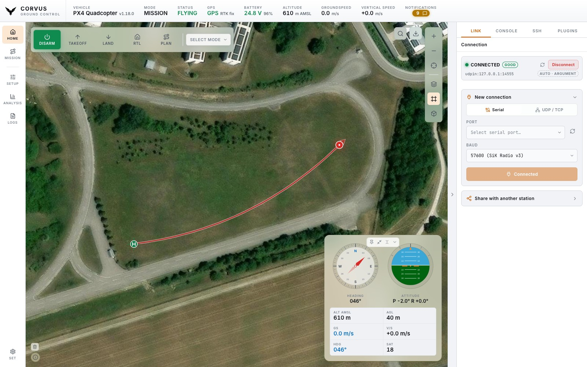
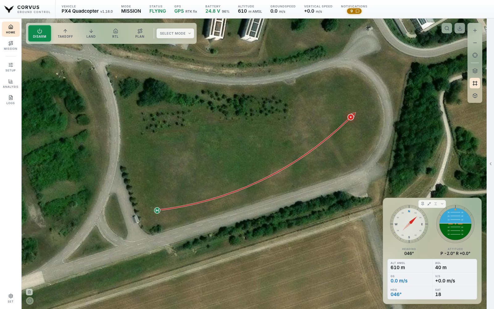
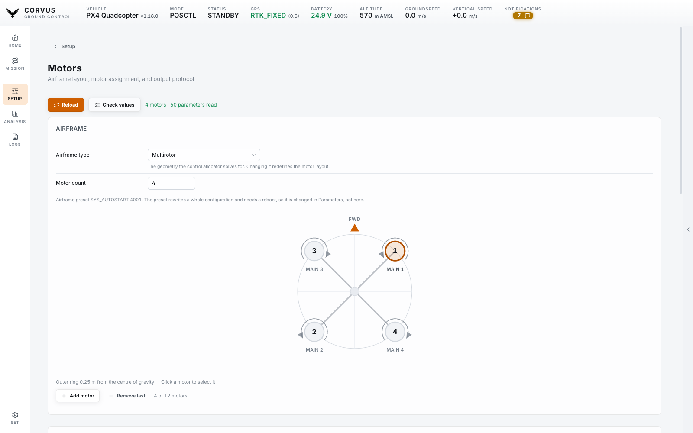
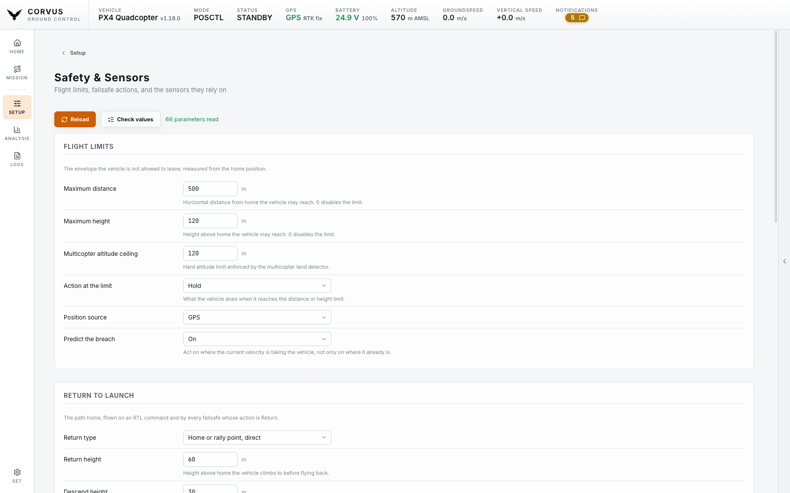
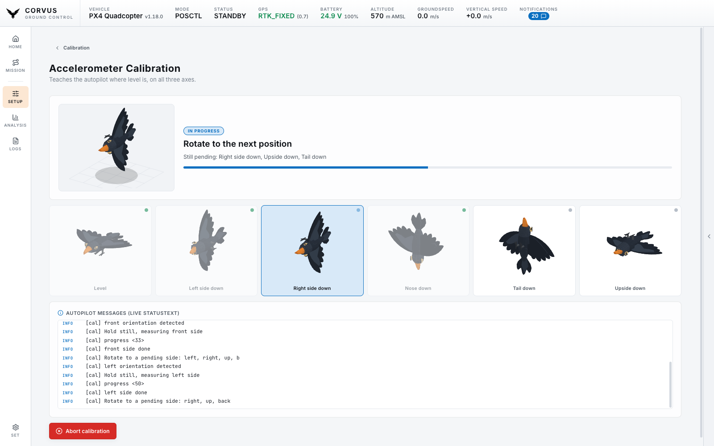
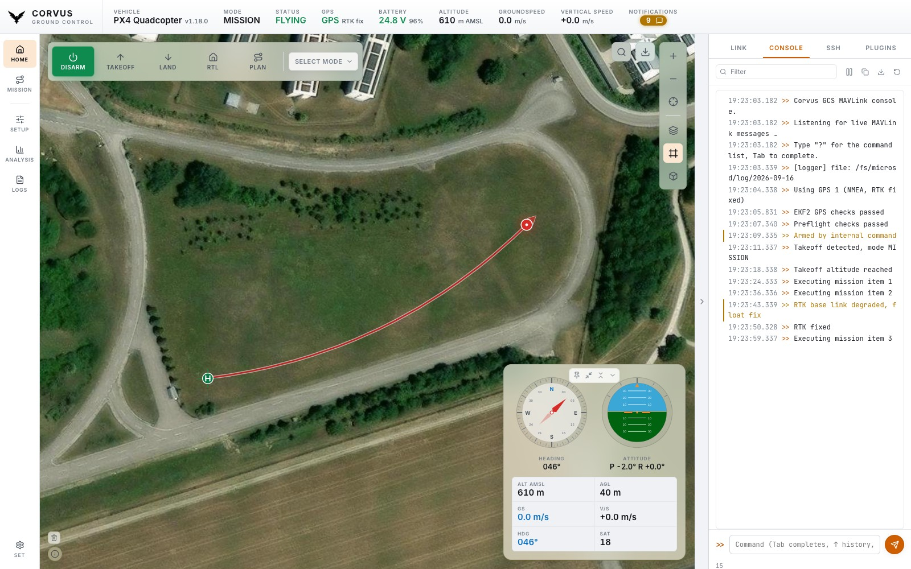
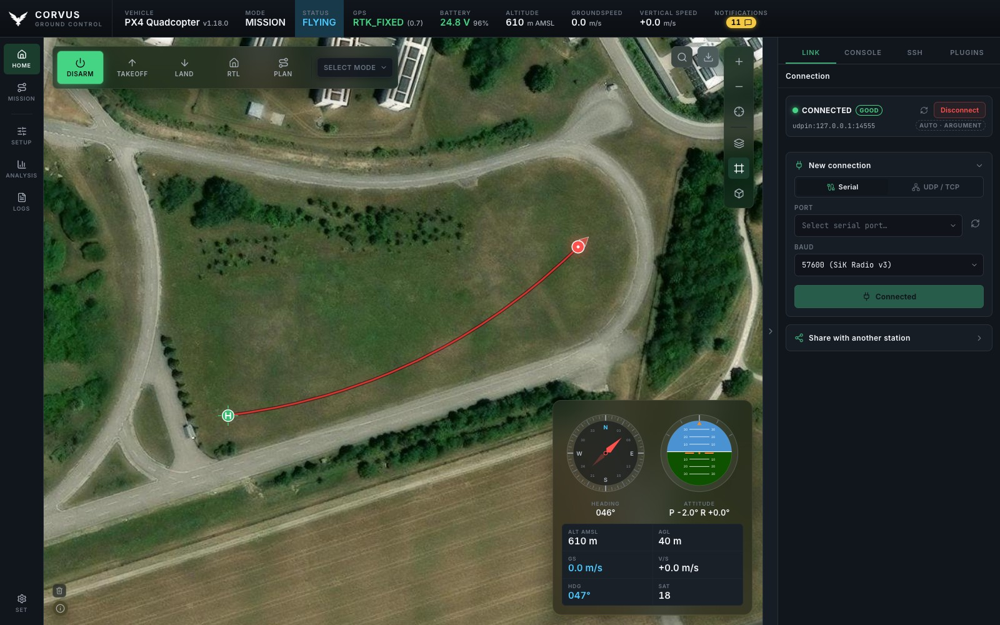
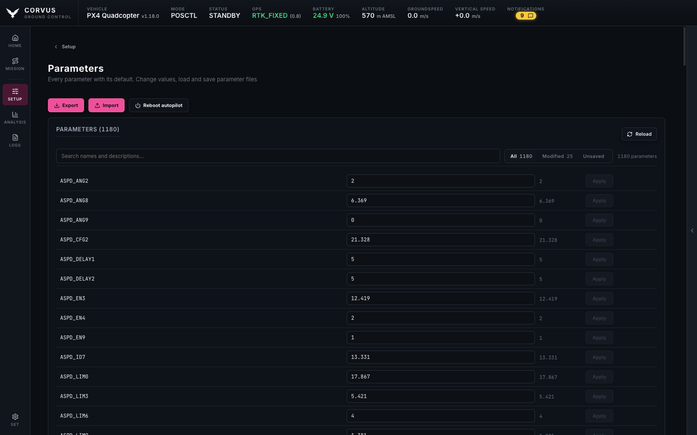

<p align="center">
  <picture>
    <source media="(prefers-color-scheme: dark)" srcset="assets/CorvusGCS_logo.png">
    
  </picture>
</p>

<h1 align="center">Corvus GCS (CGCS)</h1>

<p align="center">
  <em>A modern, offline-first Ground Control Station for PX4 autonomous aircraft —<br>
  built for the field: a laptop, a telemetry radio, and no internet.<br>
  Loads only what it needs, so it is <strong>ready to fly in seconds, not minutes</strong>.</em>
</p>

<div align="center">
  <!-- corvus:version-badge -->
  
  
  <a href="https://www.python.org/" target="_blank"></a>
  
  <a href="https://developer.mozilla.org/en-US/docs/Web/JavaScript" target="_blank"></a>
  
  <!-- <a href="https://github.com/ArduPilot/pymavlink" target="_blank"></a>
   -->
  <a href="https://px4.io/" target="_blank"></a>
  <br>
  
  
  
  
  
  <br>
  
  
  
  
  
  
  <a href="LICENSE.md"></a>
</div>

<!--
  The version badge above shows a real number, and it cannot go stale: the
  pre-commit hook that bumps VERSION rewrites that badge from it in the same
  step, so the two are updated together or not at all. Do not hand-edit the
  number, and do not remove the corvus:version-badge marker — the hook finds
  the line by it. VERSION remains the single source of truth; the badge is a
  generated view of it, not a second place to maintain.
-->

<p align="center">
  
</p>

<p align="center"><em>Live map, the floating instrument panel, and the engineering workspace on the right.</em></p>

---

## Contents

- [Contents](#contents)
- [What is Corvus GCS?](#what-is-corvus-gcs)
  - [Fast to ready-for-flight](#fast-to-ready-for-flight)
- [Why this project exists](#why-this-project-exists)
- [Features](#features)
- [Screenshots](#screenshots)
- [Install \& run](#install--run)
  - [The easy way — a ready-made app](#the-easy-way--a-ready-made-app)
  - [From source](#from-source)
- [Connect to your aircraft](#connect-to-your-aircraft)
  - [Run QGroundControl at the same time](#run-qgroundcontrol-at-the-same-time)
  - [One Corvus at a time](#one-corvus-at-a-time)
- [Using Corvus](#using-corvus)
  - [The map and the flight HUD](#the-map-and-the-flight-hud)
  - [Offline maps](#offline-maps)
  - [Setup — motors, safety, parameters, calibration, tuning, firmware](#setup--motors-safety-parameters-calibration-tuning-firmware)
  - [Analysis — logs, Flight Review and Telemetry Review](#analysis--logs-flight-review-and-telemetry-review)
  - [The side workspace](#the-side-workspace)
  - [Settings](#settings)
- [Plugins](#plugins)
  - [Adding your own](#adding-your-own)
- [Console commands](#console-commands)
- [PX4 compatibility](#px4-compatibility)
- [Get involved](#get-involved)
- [About / Origins](#about--origins)
- [License](#license)

---

## What is Corvus GCS?

**Corvus GCS is a ground control station for PX4-based autonomous aircraft.**
It is the software you have open on a laptop while an aircraft is in the air:
it shows you where the vehicle is, what it is doing, and lets you talk to it —
over a serial telemetry radio, UDP, or TCP.

It is a Python backend plus a web frontend, wrapped into a single standalone
desktop application. There is no server to deploy and no browser tab to
manage: one window, one process, one clean shutdown.

**What it is used for**

- **Flying and monitoring** — a large live map with the vehicle, its home point
  and its flown track, plus a floating flight-instrument HUD (compass, attitude
  indicator, altitude, speeds, GPS) that stays visible while you fly.
- **Preparing an aircraft** — motor wiring and ESC protocol on a drawing of your
  own airframe, parameters, sensor and ESC calibration, PID tuning, and
  firmware flashing, all from the same window.
- **Understanding a flight afterwards** — download the vehicle's ULog files over
  MAVLink and analyse them locally in the built-in Flight Review.
- **Working in the field** — the interface loads nothing from the internet, map
  tiles are cached into a local offline store, and named map regions can be
  downloaded ahead of time. A laptop that has never seen a network still gets
  correct icons, fonts, graphs and maps.

### Fast to ready-for-flight

> **This is the difference you notice first.** Most ground control stations pull
> the **entire** parameter set off the autopilot the moment they connect —
> a thousand-plus parameters, in full, before the interface is usable. Over a
> 57 kbps telemetry radio that is a wait measured in minutes, every single time
> you power up, and a lossy link can stall or restart the whole transfer.
>
> **Corvus loads only as much as it actually needs.** On connect it streams
> nothing but the telemetry required to fly — position, attitude, GPS, battery,
> link health. The full parameter set is fetched **lazily**: only when you open
> the Parameters page, because that is the only moment it is needed. Nothing
> else in the application waits on it.
>
> The practical effect is that Corvus is **ready to fly in seconds rather than
> minutes**, and it stays reliable on exactly the marginal links where a
> full-set download is most likely to fail. On the flight line, where you are
> standing next to a powered aircraft waiting to launch, that is the property
> that matters most — and when you *do* need parameters, they are one click
> away, with a live progress indicator and an editor that refuses writes while
> armed.

**Who it is for.** Anyone operating a PX4 aircraft who wants a ground station
that is small enough to read end-to-end, honest about what it is doing, and
built around a field laptop rather than a desk. It is a working tool, not a
demo — and because the codebase stays readable rather than sprawling, it is
also a reasonable starting point if you want to build your own ground-station
features on top.

The interface is **operator-oriented**: a map-centred layout, six colour themes
(two light, four dark), one slider that scales the whole interface from 80 % to
150 %, and a collapsible right-hand workspace holding the MAVLink console, an
SSH terminal, and a plugin slot for specialist views.

---

## Why this project exists

In my day-to-day work as a PhD researcher there is very little room for
AI-assisted, "vibe-coded" development — the setting simply does not allow for
it. That method is nonetheless becoming a real part of how software gets built,
and the only honest way to find out where it works, where it breaks, and how to
direct it well is to use it seriously on something non-trivial.

**Corvus GCS is that something.** It is a test and learning project: a place to
build up practical experience with AI-assisted development on a codebase large
enough to have real architecture, real edge cases, and real consequences when a
design decision is wrong. Every line here was written that way — hence the
badge — but under continuous human direction, review, and a test suite that is
roughly four fifths the size of the application itself.

The result is not a throwaway. The scope was chosen precisely because it is
useful: a PX4 ground station is a genuine tool with genuine field requirements,
so the project stays honest. It can be used as it is, adapted for a different
airframe or workflow, taken apart as a reference for MAVLink, offline tiling or
SSE-based telemetry, or simply read as an example of what this way of working
produces at scale.

If you are curious about AI-assisted development on real systems, or you just
need a ground station, both readings of this repository are intended.

---

## Features

Everything here is **built and working today**.

| | What you get | |
|---|---|:--:|
| ⚡ **Ready fast** | On connect Corvus loads only flight telemetry. Parameters are fetched when *you* ask for them — so you are flying in seconds, not minutes | ✅ |
| 🛩️ **Fly** | Live map, floating flight HUD, arm / takeoff / land / RTL, flight-mode selection, on-screen joystick and arrow-key control with adjustable key strength | ✅ |
| 🗺️ **Navigate** | 4 map services with 12 layers, vehicle heading, home point, the flown track, and click-the-map to fly there or move home | ✅ |
| 📴 **Work offline** | Nothing loads from the internet. Download named map areas in advance and the whole app keeps working with no connection | ✅ |
| 📡 **Connect** | Serial, UDP and TCP, a live port picker, saved recent connections, link-quality display and automatic reconnect | ✅ |
| 🔧 **Set up** | Airframe drawn to scale — click a motor to wire, position or spin-test it; ESC protocol; parameter editor with import / export; guided sensor calibration, ESC calibration, PID tuning by hand or by in-flight autotune, and PX4 firmware flashing | ✅ |
| 🛡️ **Set limits** | Maximum distance and height, the return-to-launch profile, and a failsafe action for every loss PX4 can detect — plus a distance sensor or optical-flow camera brought up by one switch, driver and estimator together | ✅ |
| 📊 **Review flights** | Download the vehicle's logs and record the live stream, then read either on your own machine: Flight Review for a ULog, Telemetry Review for the recording that exists even when the ULog does not — including the radio link, which an onboard log cannot see | ✅ |
| 🖥️ **Tools** | MAVLink console, SSH terminal to an onboard companion computer, and an extensible plugin system — the Vibration Monitor and the SSH Launcher ship with it, and dropping a folder in adds your own | ✅ |
| 🎨 **Personalise** | Six colour themes, interface scale from 80 % to 150 %, your own logo, an app-icon switch with an optional backplate — all saved between sessions | ✅ |
| 🔒 **One at a time** | Launching Corvus while it is already running tells you so instead of splitting one serial link's telemetry across two windows — with `CORVUS_ALLOW_MULTI=1` as the escape hatch for a genuine two-aircraft setup | ✅ |
| 💻 **Just run it** | One standalone app for macOS, Linux and Windows. No install, no server, no browser, clean shutdown every time | ✅ |
| 🔔 **Stay current** | Tells you when a newer release is published on GitHub — never while you are flying, never over the network you do not have | ✅ |

**Safety is built in:** parameter writes, motor tests, firmware flashing and ESC calibration
are all refused while the aircraft is armed, and the on-screen controls never
arm, change mode, or override a failsafe. A refused write is never shown as
applied — the control snaps back to the value the aircraft still holds.

---

## Screenshots

<p align="center">
  
</p>

<p align="center"><em><strong>The map is the interface.</strong> Collapse the side panel and the whole
window becomes the operational picture — vehicle, heading, home point and the flown track, with the
instrument panel wherever you put it. It stays there across restarts and page changes.</em></p>

<p align="center">
  
</p>

<p align="center"><em><strong>Your airframe, drawn.</strong> Every motor at its real distance from the
centre of gravity, with its number, its output pin and a spin-direction arrow — so "the front-left one"
is something you point at instead of work out. Click a motor to wire, position or bench-test it.</em></p>

<p align="center">
  
</p>

<p align="center"><em><strong>Limits and failsafes.</strong> Maximum distance and height, the
return-to-launch profile, and an action for every loss PX4 can detect. A distance sensor or
optical-flow camera comes up with one switch — driver and estimator together.</em></p>

<p align="center">
  
</p>

<p align="center"><em><strong>Guided calibration.</strong> PX4 names the six accelerometer positions in
its own order and in its own vocabulary — it names the side facing <strong>down</strong>, so "up" means
upside down. So each one is drawn instead of named: hold the aircraft the way the bird is held. Every position
is ticked off as PX4 accepts it, the autopilot's own messages run underneath, and a calibration in
progress can be cancelled on the vehicle. Compass, gyro, level horizon, barometer and airspeed work the
same way.</em></p>

<p align="center">
  
</p>

<p align="center"><em><strong>Review the flight.</strong> Download the vehicle's logs, record the live
stream, and open either in the built-in Flight Review — on your own machine, with nothing uploaded
anywhere.</em></p>

<p align="center">
  
</p>

<p align="center"><em><strong>The side workspace.</strong> A MAVLink console, an SSH terminal for the
companion computer, and a plugin slot — beside the map rather than instead of it.</em></p>

<p align="center">
  
</p>

<p align="center">
  
</p>

<p align="center"><em><strong>Six themes, two light and four dark.</strong> Switching is instant — no
reload, no flash — and the map, the plots and the instruments all follow.</em></p>

<p align="center"><sub>Every screenshot is the real interface driven by real MAVLink: telemetry,
parameters and the flown track all arrive over the wire and are parsed by the same code a flight uses.
The aircraft producing them is simulated, not airborne — the imagery is the Neubiberg test site.</sub></p>

---

## Install & run

### The easy way — a ready-made app

Download the build for your machine and run it. Nothing else is needed: Python,
Qt and every dependency are already inside.

| Platform | File | First launch |
|---|---|---|
| **macOS** (Apple Silicon) | `Corvus_GCS-<version>-macOS-arm64.dmg` | Drag to `/Applications`. The build is not notarized, so the first time use **right-click → Open**. |
| **Linux** (x86_64) | `Corvus_GCS-<version>-x86_64.AppImage` | `chmod +x` it, then run it. Works on a clean Ubuntu/Debian with no system Python or Qt. |
| **Windows** (x64) | `Corvus_GCS-<version>-windows-x64.zip` | Unzip anywhere and run `Corvus GCS.exe`. The build is unsigned, so SmartScreen asks once — *More info → Run anyway*. |

To pass a port and a connection at startup, launch it from a terminal:

```bash
"/Applications/Corvus GCS.app/Contents/MacOS/corvus-gcs" 8000 serial:/dev/tty.usbserial-0001:57600
```

```powershell
& ".\Corvus GCS\Corvus GCS.exe" 8000 serial:COM7:57600
```

On Windows the serial port is a `COM` name rather than a device path — pick it
from the dropdown on the LINK tab and you never have to type one. Ports past
`COM9` need the escaped form, `\\.\COM12`, which is what the dropdown fills in.

### From source

Requires **Python 3.10+**. One command creates the environment and opens the app:

```bash
./run.sh
```

```bash
./launch.sh    # start again later, without rebuilding the environment
./run.sh 8000 serial:/dev/ttyUSB0:57600    # with a connection
```

For development you can also run just the backend and open it in a browser:

```bash
python3 serve.py        # -> http://localhost:8000/
```

<details>
<summary>Building the standalone apps yourself</summary>

<br>

```bash
./build.sh          # Linux -> AppImage,  macOS -> .app
./build.sh --dmg    # macOS: also produce a .dmg
```

```powershell
.\build-windows.ps1 -Zip    # Windows -> dist\Corvus GCS\ + a versioned .zip
```

`build.sh` dispatches to the platform script for the host you are on and never
pretends to cross-build; Windows is PowerShell, so it has its own entry point
rather than a shell one. All three produce a self-contained bundle carrying a
Python interpreter, Qt and every runtime dependency, named from the
[`VERSION`](VERSION) file.

**Linux** needs Ubuntu/Debian x86_64, `python3` (3.10+), `pip`, `wget` or
`curl`, and ~1 GB of free disk. The first run downloads `appimagetool` and the
Python wheels and caches them under `build/`.

**macOS** needs the Xcode command line tools (`xcode-select --install`) and a
**framework** CPython 3.10+ (Homebrew's `python@3.11` or a python.org install).
A conda interpreter cannot be relocated into a bundle and is rejected with a
clear error. The bundle is ad-hoc signed; set
`CODESIGN_IDENTITY="Developer ID Application: ..."` to sign it properly.

**Windows** needs a 64-bit python.org CPython 3.10+ on `PATH` (a conda
interpreter is rejected — its DLLs live outside the prefix and cannot be
packaged) and ~2 GB of free disk for Qt. Unlike the other two the bundle is
built with PyInstaller rather than a hand-relocated interpreter: Windows puts
no constraint on where a DLL may point, so there is nothing for the extra 300
lines to buy. `assets\corvus-gcs.ico` is generated from the logo when Pillow is
installed; without it the build still succeeds, with the default icon.

Build artifacts (`build/`, `dist/`, `*.AppImage`, `*.dmg`, the Windows `.zip`)
are gitignored. CI runs the same scripts — see
[`.github/workflows/build.yml`](.github/workflows/build.yml) and
[`.gitlab-ci.yml`](.gitlab-ci.yml).

</details>

---

## Connect to your aircraft

Open the **LINK** tab in the side panel and pick how you are connected. This is
the normal way to connect — a command-line connection string is only for
scripting. Serial and UDP/TCP share one card and one **Connect** button; the
switch at the top of it chooses which, and it opens on whichever kind you
connected with last.

- **Serial** — choose the port from the dropdown (it is re-read every time you
  open the tab, so a radio plugged in after launch just appears) and a baud
  rate. 57600 is the default, labelled for the Holybro SiK Radio V3. The port
  you last flew stays on the list even when it is unplugged, marked *not
  connected*, so an empty dropdown is never the whole answer.
- **UDP / TCP** — type a connection string such as `udp:0.0.0.0:14550`, or use
  one of the presets for the endpoints PX4 publishes. Presets fill the field
  rather than connecting outright, so you can edit before you commit.
  `udp:`/`udpin:` bind and wait; `udpout:` dials out, which is what a
  **mavlink-router** `UdpEndpoint` in `Mode = Server` needs (there the router
  binds and the station speaks first), and what reaches a router behind NAT.
  `tcp:` connects to a `TcpEndpoint`, `tcpin:` listens for one.
- **Recent connections** sit at the top of the tab, one click to reuse, and are
  kept exact — a `:57600` and a `:115200` link to the same port are different
  entries, because collapsing them would silently reconnect at the wrong baud.
  The newest is also the tab's memory: the card reopens on that kind, port and
  baud, so a laptop opened at the field is one button from the link it had.
- **Disconnect** frees the radio without quitting the app, and works *during* a
  connection attempt too — which is exactly when a retry loop needs stopping.

### Run QGroundControl at the same time

A serial port, a USB autopilot and a SiK radio can each be opened by exactly
one program, so a second ground station has always meant closing the first. It
does not have to. Tick **Mirror this link over UDP** on the LINK tab, then
start QGroundControl. Nothing to configure on either end and nothing to
install: 14550 is the UDP link QGroundControl opens by itself, Corvus mirrors
every frame there from the first one, and the router is inside Corvus and stops
when Corvus does.

Corvus deliberately does *not* bind 14550 itself — it listens on 14551 and
talks first. The distinction is the difference between the feature working and
the feature looking like it works: QGroundControl's default link **binds**
14550 and waits to be spoken to, so a Corvus that binds it too leaves two
listeners and no talker. On Linux the second bind fails and QGroundControl has
no link; on macOS both binds succeed and the more specific socket silently
takes every datagram, so QGroundControl shows a connected link that receives
nothing and neither program reports an error. If something else already holds
14551, Corvus takes any free port instead and says which on the LINK tab —
mirroring outward needs no fixed local port, and losing the whole feature over
one would be the wrong trade.

By default the second station is a *screen*: telemetry flows out to it and
nothing flows back. **Let it command the aircraft** is a separate switch,
because two stations that can both arm and both change mode is a hazard rather
than a convenience, and only you know whether you want it. Turn it on and
QGroundControl's frames reach the aircraft byte-for-byte — mission uploads,
mode changes, parameter writes — with Corvus still recording the whole stream
to its tlog.

One setting to change on the other station: **give QGroundControl a different
MAVLink system ID.** Corvus deliberately uses the GCS identity 254/190 (system
ID / component ID), and PX4 tracks message sequence numbers per system ID — two
stations sharing one makes the autopilot report packet loss that is not
happening, and muddies which station a GCS failsafe is about. In QGroundControl
it is *Application Settings → MAVLink → Ground Station system ID*; 255 is a
fine choice. If you forget, the LINK tab says so: Corvus notices a second
station transmitting under 254 and names the setting to change.

Whether you share the link this way or put **mavlink-router** in front of it,
the link then carries more than the aircraft — the other station's heartbeat,
a companion computer, a gimbal, sometimes a second vehicle. Corvus reads only
its own aircraft off that link: another node's heartbeat cannot change the
armed flag or the flight mode, cannot keep a lost aircraft looking connected,
and the command target is picked from the first heartbeat that comes from an
actual autopilot rather than the first heartbeat of any kind.

### One Corvus at a time

Launching Corvus while Corvus is already running brings up a message saying so
rather than a second window. That is deliberate, and it is the same constraint
as the one above: a serial port can be opened by exactly one program *usefully*,
but on Linux and macOS the operating system does not enforce it. Two copies both
open `/dev/ttyUSB0` without either being told anything is wrong, and each one
then reads whatever bytes it got to first — so both windows show the same
aircraft with half its telemetry missing. Attitude updates while position
freezes; a command's acknowledgement arrives in the other window. Neither shows
a disconnect, because from each program's point of view nothing failed.

It is the quietest way this application can be badly wrong, so the second launch
is stopped before it opens anything, and told where the first one is listening.
The forwarder's UDP port, the tile database and `~/.corvus/config.json` are
shared the same way, only less dangerously.

If you genuinely want two — two aircraft, two radios, two separate links on one
laptop — set `CORVUS_ALLOW_MULTI=1` and both will start. Give the second one its
own connection string and its own forwarding port; they still cannot share a
radio, and they will write over each other's settings.

```bash
CORVUS_ALLOW_MULTI=1 ./run.sh
```

The guard is a lock the operating system holds on the running process, not a
file left behind on disk — so a Corvus that crashed, was force-quit, or died
with the machine leaves nothing to clean up. The next launch just works.

Next to the connection state you get **link quality**, not just "connected":
signal strength, heartbeat regularity and receive errors. Connected tells you
the socket is up; link quality tells you whether it is worth flying on.

| State | Indicator |
|---|---|
| Connecting / reconnecting | Yellow dot (last error shown) |
| Connected | Green dot |
| Disconnected | Grey dot |
| Ready to fly | **READY** in a green pill — the autopilot's own preflight checks pass |
| Armed, on the ground | **ARMED** in an amber pill — propellers are live and the aircraft is still within reach |
| Airborne | **FLYING** in a blue pill — from the vehicle's own `EXTENDED_SYS_STATE`, falling back to height above home on firmware that does not send it |
| Preflight failing | Amber **NOT READY** — the autopilot would refuse to arm; the failing check is in the notifications |
| Readiness not reported | Grey **STANDBY** — firmware that does not publish its preflight state |

The three states worth recognising at a glance — cleared to fly, propellers
live, airborne — carry a tinted pill as well as a colour, so they are
distinguishable by shape before the colour is read at all. `NOT READY`
deliberately gets no pill: it is the absence of a clearance, not an active
state.

Notification counts follow the same principle. The badge is **green** when the
board is empty, **blue** when the only unread lines are informational (a normal
flight produces a steady trickle of those), **amber** for a real warning and
**red** for a critical. It used to go amber for anything unread at all, which
taught the operator to ignore the one colour that has to keep working.

<details>
<summary>Holybro SiK Telemetry Radio V3, and simulation</summary>

<br>

On Linux the radio enumerates as **two** devices, e.g. `/dev/ttyUSB0` and
`/dev/ttyUSB1`. The **lower-numbered one** is the MAVLink data port.

| Setting | Value |
|---|---|
| Device path | `/dev/ttyUSB0` (the lower of the two) |
| Baud rate | 57600 (factory default) |
| Connection string | `serial:/dev/ttyUSB0:57600` |

On a serial link Corvus automatically applies conservative MAVLink stream rates
so a 57 kbps radio is not saturated, allows a longer heartbeat timeout (10 s),
and reconnects with backoff if the link drops.

**PX4 SITL** publishes to UDP 14550 (the ground-station link), which Corvus
binds automatically on startup:

```bash
make px4_sitl     # in the PX4-Autopilot directory
```

**Alongside MAVROS / MAVSDK / ROS.** Those bind UDP **14540**, PX4's *onboard*
link — a different socket from the 14550 one Corvus uses. Only one process can
hold a UDP port, so pointing Corvus at 14540 while MAVROS is running (or the
other way round) leaves one of them with no telemetry at all. On a simulator
that looks like a broken vehicle rather than a port clash, which is why Corvus
now names the conflict when the bind fails. Leave Corvus on 14550, and if you
need both on the same endpoint put a **mavlink-router** in front and give each
one its own port.

**What needs a position, and what does not.** Corvus asks the aircraft for
`HOME_POSITION` as soon as it connects, and needs home (or the global position)
only where an altitude has to be *converted* or *set*:

| Action | Without a position reference |
|---|---|
| Takeoff | Waits briefly, then sends it anyway with the altitude field unspecified, so the **vehicle** picks its own configured takeoff altitude. You get a warning, not a refusal. |
| Fly to points | Unaffected. Mission items carry your AGL number directly in `MAV_FRAME_GLOBAL_RELATIVE_ALT`, so nothing has to be converted. |
| Set home | Waits briefly, then **refuses**. This altitude is not being converted for the wire — it is the altitude home will *have*, and home altitude is what RTL descends to. Guessing it would move the landing point vertically as a side effect of dragging it sideways. |

Whether the aircraft can actually take off stays the autopilot's decision; if it
cannot, its own refusal reaches you with a reason attached.

</details>

---

## Using Corvus

### The map and the flight HUD

The map is the centre of the app. Your aircraft is drawn with a **heading cone**
and a white separating ring so it stays visible over any imagery, the **home
point** is a landing-pad mark on the exact coordinate, and the **flown track**
trails behind you in red.

The track survives a link drop — only an actual vehicle reboot clears it, or the
small clear button in the map's corner. That way a dropout does not erase where
you have been.

**Click anywhere on the map** to open a menu: fly to that position, or move the
home point there.

The **flight HUD** — compass, attitude indicator, altitude, speeds, heading and
satellite count — floats over the map in a window you control. Grab it anywhere
that is not a button and move it, **pin** it so a stray gesture cannot shift it,
shrink it to a compact size, or collapse it away; double-click sends it back to
its corner. The on-screen control pad moves the same way.

Where you put either window stays put: across restarts, across a trip to Setup
or Options and back, and when the side workspace slides open — a window parked
against the right edge travels in with it rather than disappearing behind it.

### Offline maps

Corvus caches every map tile it fetches into a local store, so ground you have
already looked at keeps working with no connection.

To prepare for a field trip, use **Download offline map** on the map and select
an area. Downloads are **named**, listed, and drawn as outlines on the map, so
"what do I actually have offline?" is a question you can answer at a glance
instead of guessing from coordinates.

Panning onto ground you never downloaded stays fast: after a few failed
lookups Corvus stops trying for 30 seconds, so cached tiles render at full speed
and the rest simply stays blank rather than freezing the map. Walking back into
coverage recovers on its own.

### Setup — motors, safety, parameters, calibration, tuning, firmware

- **Motors** — your airframe, drawn. Every motor sits at its real distance from
  the centre of gravity with its number, its output and a spin-direction arrow,
  so "the front-left one" is something you point at instead of work out. The
  body behind them follows the airframe class: arms for a multirotor, a wing and
  tail for a plane, booms plus a wing for a quadplane, a rotor disc and tail
  boom for a helicopter, a chassis for a rover. A rotor that pushes rather than
  lifts — a VTOL's pusher, a plane's tractor — is drawn with a thrust arrow
  instead of a boom, read from its own axis parameters. PX4 stores no wingspan,
  so the outline is schematic and the page says so; only the motors are
  measured.
- Click a motor to select it, then set which output drives it — MAIN, AUX or
  DroneCAN, and which pin — along with its position and rotation. Picking a pin
  that already has a motor on it swaps the two, which is the one-click fix for
  crossed motors; picking one that drives a servo is refused by name rather than
  silently taken. A motor wired to nothing is flagged on the drawing. The
  airframe type and the motor count sit on the same card, next to the picture
  they change, and adding or removing a motor redraws it.
- **Motor test** — spin one motor on the bench to find out which one it is.
  **Remove the propellers first**: the button will not enable until you confirm
  you have, it is refused while armed, the throttle stops at half, and the
  duration is bounded on the *vehicle*, so the motor stops even if the link
  dies. Leaving the page stops a running motor.
- **Output protocol** — DShot150/300/600/1200, OneShot or a plain PWM rate per
  timer group, plus the PWM endpoints. Reading the whole page costs about a
  hundred parameters, not the full set, so it opens in a second, and only what
  the connected firmware actually reports is shown — the page is honest across
  PX4 versions rather than offering settings your board does not have. Every
  field is written back one at a time, confirmed by the aircraft, and the whole
  page is read-only while armed.
- **Safety & Sensors** — the envelope the aircraft is allowed to use, in one
  page: maximum distance and height from home and what happens at the limit,
  the return-to-launch profile (return and descend height, the climb cone, the
  loiter before landing), and a failsafe action for every loss PX4 can detect —
  RC, data link, position, battery, actuator — with the battery levels that
  trigger them.
- **Distance sensor and optical flow** — on the same page, because a ground
  lidar is what half those limits lean on. One switch brings a sensor up:
  Corvus starts the driver *and* tells the estimator to fuse it, which is the
  step usually missed — a rangefinder reading perfectly while the EKF ignores
  it looks exactly like a working sensor. Pick the model (Lightware,
  Lidar-Lite, Benewake, PMW3901 and the rest, or a sensor arriving over
  MAVLink), name the serial port if it needs one, and the few settings that are
  genuinely per-airframe — mounting offset, height limits, quality gates — stay
  underneath. The state line always names both halves, so a half-configured
  sensor cannot look finished.
- **Parameters** — the full set is downloaded only when you open this page (see
  [Fast to ready-for-flight](#fast-to-ready-for-flight)), with a live progress
  bar. Then you can edit any value; writes are confirmed by the aircraft and
  **refused while armed**. *Export* and *Import* write and read a readable JSON
  file with the airframe and date in the name.
- **Sensor calibration** — a guided wizard for compass, gyro, accelerometer,
  level horizon, airspeed and baro. The aircraft is drawn in the position PX4 is
  asking for, each orientation is ticked off as it completes, and a running
  calibration can be cancelled on the vehicle.
- **Motor / ESC calibration** — behind a safety confirmation, because motors
  spin at full PWM. **Remove the propellers first.** Refused while armed.
- **Radio Control** — the transmitter in your hands, on one page. Live channel
  bars sit at the top and each one says what it is bound to, so "is the radio
  even talking, and is that switch the one I think it is" is answered by
  looking rather than by a test flight. Underneath: which input the vehicle
  accepts and what it does when the transmitter goes quiet, the stick channels,
  the flight-mode switch with its six positions, every other switch PX4 can
  bind — arm, kill, return, hold — and the AUX passthroughs. Next to every
  channel picker is **Detect**: press it, move the switch, and Corvus binds the
  channel that moved. A channel bound to two actions at once is flagged, because
  PX4 permits it and a kill switch sharing the mode switch's channel fires on a
  mode change.
- **Radio calibration** — a guided wizard, and on this page the wizard *is* the
  calibration: PX4 has no autopilot-side RC procedure, so a ground station has
  to watch the channels while you sweep every control and write the endpoints it
  saw. Centre the sticks, sweep everything through its travel, then move one
  named stick at a time — the channel that answers is the one that gets bound,
  and the direction it moved decides whether PX4 has to reverse it. Nothing is
  written until you have seen the whole measurement, and a channel that never
  really moved is refused by name instead of being written as a stick that
  works like a switch. The six mode positions light up live, so you can check
  the order before you take off rather than in the air.
- **PID Tuning** — its own page, split the way the controller is: rate,
  attitude, velocity and position, one tab per loop, innermost first. Every
  gain is editable by hand and written back one at a time, confirmed by the
  aircraft — autotune only covers two of the four loops, so a page that offered
  nothing else could not tune a vehicle. Each tab plots what the controller
  *asked for* beside what the airframe *did*, because a response trace on its
  own cannot tell a gain that is too low from one that is too high. Only the
  loops the connected firmware reports are shown, so a multicopter and a fixed
  wing each get their own.
- **Autotune** — PX4 tunes the rate and attitude controllers together, **in
  flight**: it injects steps and measures what comes back, so the vehicle has to
  be armed and hovering. The page says that up front, states the preconditions
  before you take off, refuses to send the command on the ground, and follows
  PX4's own progress to a stop button that works throughout. PX4 v1.16–v1.18
  expose no separate roll, pitch or yaw selection through this command.
- **Firmware** — flash PX4 firmware over a **direct USB connection only**.
  Refused over a telemetry radio or UDP/TCP, and refused while armed.

### Analysis — logs, Flight Review and Telemetry Review

- **Vehicle logs (ULog)** — browse the flight controller's SD card and download
  logs. Tick several and walk away: they are fetched one after another with a
  progress bar and a Cancel that works throughout. Files land as
  `log_<id>_<UTC date>.ulg`, still readable a month later.
- **Recorded tlogs** — the MAVLink stream Corvus recorded on this laptop, one
  file per flight session, written from the first frame of every connection
  without being asked. This is the log that always exists.
- **Flight Review** — pick a downloaded log and Corvus reduces it to the plots
  that answer *"was that flight healthy?"* — motors, clipping, EKF, battery —
  with findings above the plots and the aircraft's own messages below, filtered
  by severity. **A log that never came through Corvus can be opened too**, from
  anywhere on your machine. Everything is parsed locally; nothing is uploaded.
- **Telemetry Review** — the same page, for a recording rather than a ULog.
  The ULog is the better log and, when you can get it, it is the one to read.
  This exists because you cannot always get it: the card was not fitted, the
  download would take an hour over a 57600 link, or the aircraft did not come
  back. Corvus recorded the flight on this laptop either way, so pick a tlog
  and it is reduced to the same plots, the same mode and armed bands, the same
  findings and the same message log — drawn by the renderer Flight Review
  already uses, so the two read alike.

  What it can and cannot show is stated on the page rather than left for you to
  find out. Telemetry arrives at 1–50 Hz, not a ULog's 200–1000: an oscillation
  is visible, the shape of one cycle is not. There are no motor outputs and no
  per-IMU data — those never leave the aircraft. And there is one thing a ULog
  can never have: **the link itself**. RADIO_STATUS, the drop counters and both
  ends' signal strength describe the radio between you and the aircraft, which
  a log written on board has no way of knowing about.

### The side workspace

A collapsible panel beside the map, so tools never replace the operational
picture.

- **MAVLink console** — your direct line to the airframe. Filter the live
  stream, and read severity off the colour rather than hunting through level
  buttons: errors red, warnings amber, success green, your own commands
  accented, shell replies blue. **Pause** freezes the view while still buffering
  behind it, so reading one message does not cost you the next fifty. Tab
  completes commands, `?` prints the whole command table, history is kept across
  launches, and Copy / Save hand you the visible lines for a bug report.
- **SSH** — a real terminal into an onboard companion computer, not a command
  box: every keystroke goes straight to the remote shell, so `top`, `vim`,
  `sudo` password prompts, colour output and Ctrl-C all behave the way they do
  in any other terminal, and the prompt you see is the machine's own. The
  remote is told the terminal's actual size, and the panel is a few hundred
  pixels wide, so there is a **full-screen** button next to the connection name
  (Shift-Escape leaves it — plain Escape belongs to whatever is running).
  Connections are **saved by name** with password or key-file authentication,
  so reconnecting is one click.
- **Plugins** — specialist views that plug in without touching the core. Two
  ship with it: the **Vibration Monitor**, a live graph of the aircraft's
  vibration levels plus cumulative clipping counters, and the **SSH Launcher**,
  a shelf of one-press buttons that start programs on a companion computer,
  each with its own terminal to watch and stop them in. Both are ordinary
  plugin folders, and you can add your own — see [Plugins](#plugins) below.

### Settings

Reachable from **SET** at the bottom of the left rail. Everything applies
instantly and is saved.

- **Appearance** — six colour themes (two light, four dark), an interface-size
  slider from 80 % to 150 % that scales the entire app, your own company
  logo in the top right, and an **app-icon switch** that flips the desktop
  app's Dock (macOS) / taskbar (Linux) icon between the white mark and the
  black one for a light dock. The icon switch changes nothing but the icon.
- **Map** — which service (Esri, OpenStreetMap, Google, Bing) and which of its
  layers. Also switchable from the layer control on the map itself.
- **Controls** — three switches, **all off by default**, for the on-screen
  manual controls: a **virtual joystick** (throttle and yaw left, pitch and roll
  right), an **arrow-key pad** for pitch and roll, and a **WASD pad** for
  thrust and yaw. The two key pads share one window and your keyboard's own
  arrow and W/A/S/D keys drive them. One **key-strength** slider (25 – 100 %,
  50 % by default) sets how far a held key pushes the stick — the same strength
  for both pads, arrows and WASD alike — and holding **Shift** flies at twice
  that strength for as long as it is down, on either pad. The slider is the
  cruise, Shift is the dash. Neither touches the sticks, which always
  reach their own stops. They are input sources only — they never arm, change
  mode, or override a failsafe.
- **SSH connections** — add, connect and remove saved hosts.
- **Files** — where parameter exports, logs and downloads are written.
- **Plugins** — what Corvus found, and a button that opens the folder you drop
  plugins into. See [Plugins](#plugins).
- **About** — version, the live connection summary, and **Credits** listing
  every bundled dependency and its licence.
- **Updates** — a switch (on by default) that compares the running version
  against the published releases on GitHub and shows a notice when a newer one
  exists, plus **Check now** for an immediate look. Nothing is downloaded and
  nothing about your machine is sent; with no internet the check fails silently.
  The notice never appears while the aircraft is armed, and **Skip this
  version** stops it coming back for that release.

---

## Plugins

The **TOOLS** tab in the side workspace is an extension point: a plugin adds
its own view there without a fork and without touching the rest of the app.

Two ship with Corvus:

- **Vibration Monitor** — a live graph of gyro coning, gyro high-frequency and
  accelerometer high-frequency vibration, with the cumulative clipping counters
  beside it. It asks PX4 for a higher `VIBRATION` rate while it is open and puts
  the default back when you close it.
- **SSH Launcher** — a shelf of buttons for the programs you start before a
  flight. Each one carries its own saved SSH connection, folder and command, so
  the mission script, the video pipeline and the log recorder are three presses
  rather than three trips to a terminal. Add, rename, edit and remove them from
  the plugin itself; they are saved and there again next launch.

  A button runs its program **in its own SSH session**, and pressing it again
  runs it again **in that same terminal** — one run under the last, in one
  scrollback, with nothing thrown away in between. (It is a real shell: if the
  last program is still running in the foreground, what you send goes to it,
  just as if you had typed it there. Ctrl-C first, or let it finish.)

  The **arrow** beside a button opens that session's terminal — a floating
  window you can move, resize, maximise and put away like any other, while the
  tab you were on stays where it was. Only the arrow opens it; pressing the
  button starts the program without throwing a window at you, which matters
  when four of them go up on the pad. Three buttons are three terminals, side
  by side when you want to see them. Output is right there to read, and Ctrl-C
  (or the window's disconnect button) is how you stop it; closing the window
  with × leaves the program running, and the arrow brings the window back with
  its scrollback intact. A green dot marks the buttons that have something
  running. Turn *Run in a terminal* off for a program that has to outlive
  Corvus itself: it is then started with `nohup` and detached, with nothing to
  watch and nothing to stop from here.

  A button does not need a connection you set up beforehand. The connection
  list in the editor ends in **New connection…**, which opens host, user,
  password and key file right there — so a shelf can be built on the pad, for a
  companion computer Corvus has never seen. What you type is saved as a normal
  SSH connection (it appears in the SSH tab, ready to be picked by the next
  button, edited or removed), named `user@host` unless you give it a name of
  your own.

  Corvus never holds the password in the plugin — a button names a saved SSH
  connection and the backend takes the credentials from there.

### Adding your own

Plugins are folders. Corvus reads two places:

| Where | What it is |
| --- | --- |
| `~/.corvus/plugins` (`%USERPROFILE%\.corvus\plugins` on Windows) | Yours. Survives updates. |
| `plugins/` inside the application | The ones that ship with Corvus — the two above live here. Replaced by an update. |

**Settings ▸ Plugins ▸ Open plugin folder** opens the first one in Finder /
Explorer / your file manager, and lists what Corvus found. Drop a folder in,
restart, and it is on the TOOLS tab. A plugin in your folder with the same id
as a shipped one replaces it, so you can patch one without editing inside the
app bundle.

One folder per plugin:

```
~/.corvus/plugins/
  my-plugin/
    plugin.json
    my-plugin.js
    my-plugin.css      (optional)
```

`plugin.json` describes it — `id` defaults to the folder name, `scripts`
defaults to `<id>.js`, `icon` is any [Lucide](https://lucide.dev) name, and
`order` decides where the card sits in the grid (lower is earlier, default 100,
ties broken by name):

```json
{
  "id": "my-plugin",
  "name": "My Plugin",
  "icon": "puzzle",
  "description": "What it does, one line.",
  "version": "1.0.0",
  "order": 100,
  "scripts": ["my-plugin.js"],
  "styles": ["my-plugin.css"]
}
```

The script registers itself as it loads and gets a container to build into
plus a small `api` — live telemetry, the MAVLink console, notifications, JSON
requests, and its own saved settings:

```js
Corvus.plugins.register("my-plugin", {
  name: "My Plugin",
  icon: "puzzle",
  description: "What it does, one line.",
  init: function (containerEl, api) { /* build your UI */ },
  destroy: function (containerEl) { /* tear it down again */ },
});
```

The full `api` is documented at the top of `src/js/plugins.js` and the manifest
in `corvus/plugin_registry.py`. Both shipped plugins are complete worked
examples that go through exactly this path — `plugins/ssh-launcher` for a form,
saved settings and a backend call, `plugins/vibration` for a live chart on the
telemetry stream. Copy one and start from there. A plugin that fails to load
costs itself and nothing else: the rest of the app, and the other plugins, come
up regardless.

A plugin is ordinary JavaScript running in the app's own page, and the SSH
Launcher runs whatever command you give it as the account you point it at. Read
a plugin before you drop it in, exactly as you would a script you were about to
run yourself.

---

## Console commands

In the MAVLink console, type:

```
help        — list commands
arm         — arm the vehicle
disarm      — disarm the vehicle
mode AUTO   — set flight mode
takeoff 10  — takeoff to 10 m
land        — land at current position
rtl         — return to launch
listener sensor_combined
            — stream a PX4 uORB topic through the MAVLink shell
shell listener sensor_combined
            — explicitly route the command to the raw PX4 shell
```

Tab completes, `↑` walks history, and `?` prints the full table — it works with
the link down, too.

---

## PX4 compatibility

Primary target: **PX4 v1.16, v1.17, v1.18.** Corvus detects the firmware version
on connect, loads the matching parameter schema, and degrades gracefully rather
than crashing when something is missing — it refuses to send a command or write
a parameter the connected firmware does not understand. All three versions are
checked before any parameter, mode or flight-plan change is accepted. Older
firmwares (v1.12–v1.15) work on a best-effort basis but are not the focus.

---

## Get involved

**Contributions, bug reports and feature wishes are very welcome.**

This project improves fastest through use. If you fly with it and something is
awkward, slow, or wrong, that is worth reporting — a short description of what
you expected and what happened is enough. The same goes for features: if your
workflow needs something Corvus does not do yet, say so. Wishes are not an
imposition here, they are the most useful input there is.

- **Found a bug?** Open an issue with the PX4 version, the connection type
  (serial / UDP / TCP), and what you were doing.
- **Want a feature?** Describe the operational problem rather than the solution
  — it usually leads somewhere better.
- **Want to contribute code?** Pull requests are welcome. `AGENTS.md` documents
  the architecture rules and conventions the codebase follows; keeping to them
  is all that is asked.
- **Just have a question?** Ask. Questions about the design decisions are
  particularly welcome — a lot of them are deliberate.

---

## About / Origins

Corvus GCS is developed with the **Universität der Bundeswehr München** (University
of the German Federal Armed Forces, Munich), in the context of the work at
**Chair LRT 1.1 of Prof. Dr. Matthias Gerdts**.

It is an **AI-assisted project** — vibe coded, under human direction and review —
and it is built for real field use rather than for demonstrations. See
[Why this project exists](#why-this-project-exists) for what that means in
practice and why the project is set up this way.

<p align="center">
  <picture>
    <source media="(prefers-color-scheme: dark)" srcset="assets/CorvusGCS_logo.png">
    
  </picture>
</p>

## License

Corvus GCS is released under the **[Sustainable Use License, Version 1.0](LICENSE.md)** —
a *fair-code* license: the source is open to read, modify and build on, but not
to resell.

In short, and without replacing the terms in [`LICENSE.md`](LICENSE.md):

- **You may** use and modify it for your own internal business purposes, and
  for non-commercial or personal use — flying your own aircraft, research,
  teaching, and building on it are all covered.
- **You may** pass it on, provided you do so free of charge and for
  non-commercial purposes, and that whoever receives it also receives these
  terms. If you modified it, say so prominently.
- **You may not** sell it, or offer it to third parties as a paid product or
  service.

Third-party components — pymavlink, paramiko, pyserial, PyQt6/Qt, MapLibre GL
JS, Plotly, Lucide — keep the licenses of their own authors. The full list, with
each component's license, is in the app under **[Settings > About >
Credits](#settings)**. The license file ships inside the AppImage and the macOS
app as well as in the repository, because the terms have to travel with the
software.

---

<p align="center">
  <sub>Developed with the Universität der Bundeswehr München · Corvus GCS (CGCS)</sub>
</p>

<p align="center">
  
</p>
