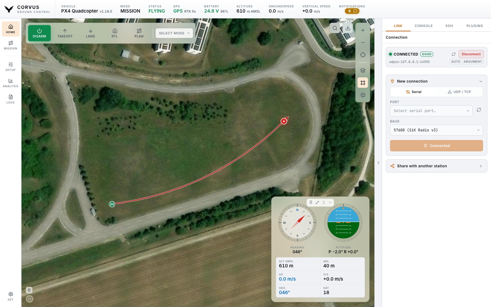
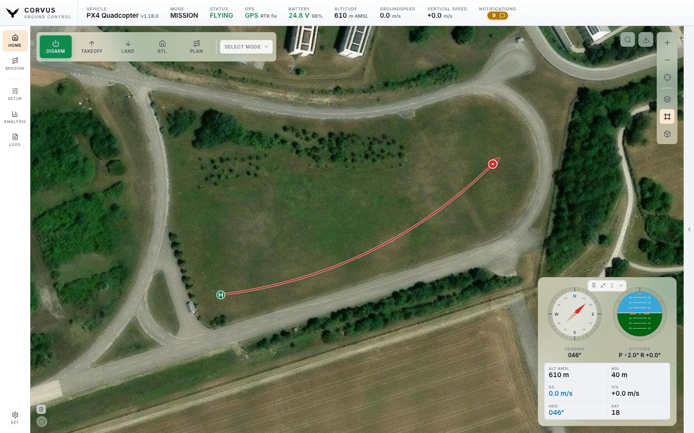
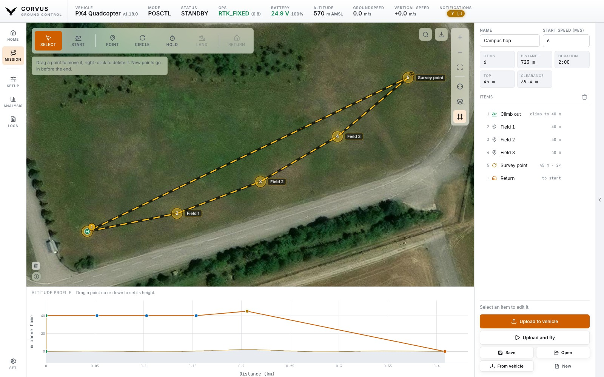
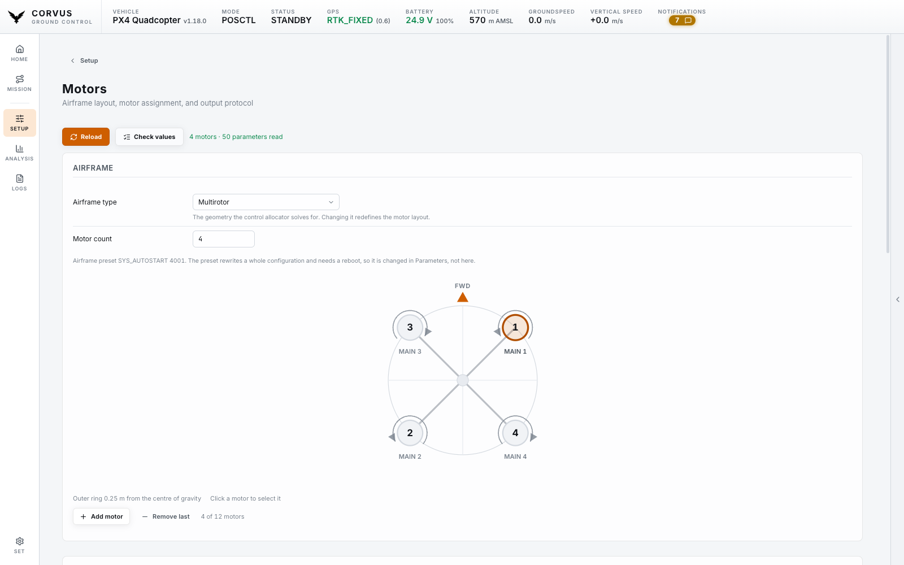
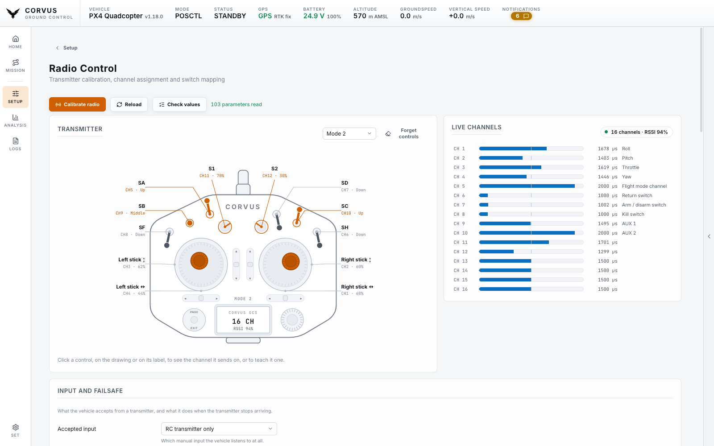
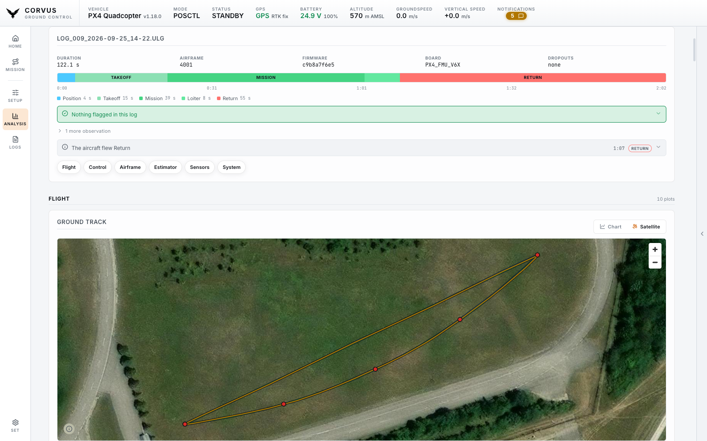
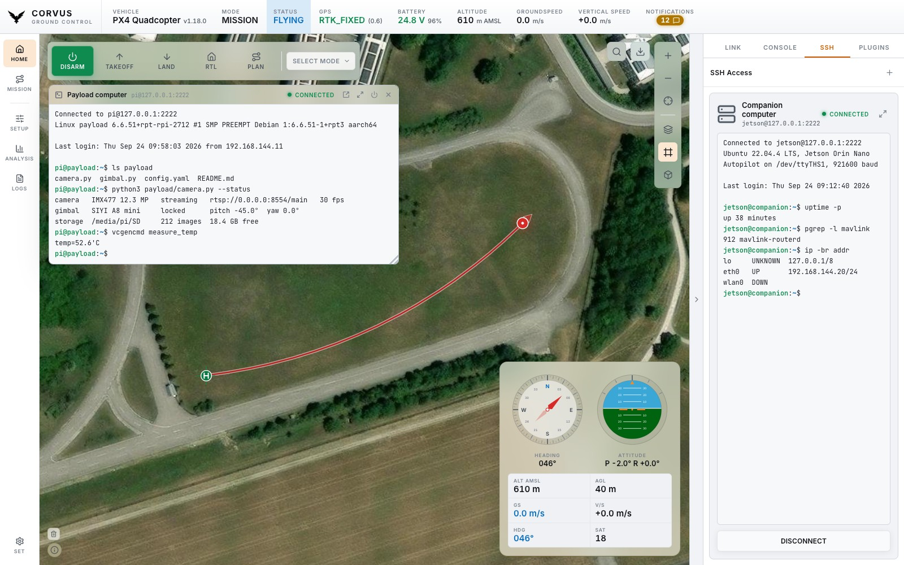

<p align="center">
  <picture>
    <source media="(prefers-color-scheme: dark)" srcset="assets/CorvusGCS_logo.png">
    
  </picture>
</p>

<h1 align="center">Corvus GCS (CGCS)</h1>

<p align="center">
  <em>A modern, offline-first Ground Control Station for PX4 and ArduPilot autonomous aircraft.<br>
  Built for the field: a laptop, a telemetry radio, and no internet.<br>
  Loads only what it needs, so it is <strong>ready to fly in seconds, not minutes</strong>.</em>
</p>

<div align="center">
  <!-- corvus:version-badge -->
  
  
  <a href="https://www.python.org/" target="_blank"></a>
  
  <a href="https://developer.mozilla.org/en-US/docs/Web/JavaScript" target="_blank"></a>
  
  
  
  <!-- <a href="https://github.com/ArduPilot/pymavlink" target="_blank"></a>
   -->
  <br>
  <a href="https://px4.io/" target="_blank"></a>
  
  <a href="https://ardupilot.org/" target="_blank"></a>
  <br>
  <!-- 
   -->
  
  
  
  <br>
  
  
  
  
  
  
  <!-- <br> -->
  <a href="LICENSE.md"></a>
</div>

<!--
  The version badge above shows a real number, and it cannot go stale: the
  pre-commit hook that bumps VERSION rewrites that badge from it in the same
  step, so the two are updated together or not at all. Do not hand-edit the
  number, and do not remove the corvus:version-badge marker; the hook finds
  the line by it. VERSION remains the single source of truth; the badge is a
  generated view of it, not a second place to maintain.
-->

<p align="center">
  
</p>

<p align="center"><em>Live map, the floating instrument panel, and the engineering workspace on the right.</em></p>


<p align="center">
  <a href="https://m-bsquared.github.io/CorvusGCS/guide/"><strong>📖 Documentation</strong></a>
  &nbsp;·&nbsp;
  <a href="https://github.com/M-BSquared/CorvusGCS/releases/latest"><strong>⬇️ Download</strong></a>
  &nbsp;·&nbsp;
  <a href="https://m-bsquared.github.io/CorvusGCS/"><strong>🌐 Website</strong></a>
</p>

---

## Contents

- [What is Corvus GCS?](#what-is-corvus-gcs)
- [Features](#features)
- [Screenshots](#screenshots)
- [Install \& run](#install--run)
- [Connect to your aircraft](#connect-to-your-aircraft)
- [Documentation](#documentation)
- [Flight-stack compatibility](#flight-stack-compatibility)
- [Why this project exists](#why-this-project-exists)
- [Get involved](#get-involved)
- [About / Origins](#about--origins)
- [License](#license)

---

## What is Corvus GCS?

**Corvus GCS is a ground control station for autonomous aircraft running PX4 or
ArduPilot.** It is the software you have open on a laptop while an aircraft is
in the air: it shows you where the vehicle is, what it is doing, and lets you
talk to it over a serial telemetry radio, UDP, or TCP.

It is a Python backend plus a web frontend, wrapped into a single standalone
desktop application. There is no server to deploy and no browser tab to
manage: one window, one process, one clean shutdown.

- **Fly and monitor**: a live map with the vehicle, its home point and its
  flown track, a floating instrument panel, and a 3D view with real terrain
  and buildings.
- **Prepare the aircraft**: motors on a drawing of your own airframe,
  parameters, calibration, radio, PID tuning and firmware, in the same window.
- **Review the flight**: download the vehicle's logs, or use the recording
  Corvus made itself, and read either in the built-in Flight Review.
- **Work in the field**: nothing loads from the internet. Maps, elevation and
  buildings can be downloaded in advance for a field with no connection.

> **Ready to fly in seconds, not minutes.** Most ground stations download the
> whole parameter set (a thousand or more values) before the interface is
> usable, which takes minutes over a 57600 baud radio. Corvus streams only the
> telemetry flying needs and fetches parameters when you open the Parameters
> page, so it is ready in seconds and stays usable on marginal links.

---

## Features

Everything here is **built and working today**. Each row links to the page of
the documentation that explains it.

| | What you get |
|---|---|
| ⚡ **Ready fast** | Flight telemetry only on connect; parameters when *you* ask for them. [More](https://m-bsquared.github.io/CorvusGCS/guide/index.html#ready-in-seconds) |
| 🛩️ **Fly** | Live map, floating flight HUD, arm / takeoff / land / return, flight modes, click the map to fly there, on-screen joystick and keyboard control, and an optional preflight checklist. [More](https://m-bsquared.github.io/CorvusGCS/guide/flying.html) |
| 🌍 **See in 3D** | A spinnable globe, real terrain at true scale, OpenStreetMap buildings, and the aircraft drawn at its real altitude. [More](https://m-bsquared.github.io/CorvusGCS/guide/3d-offline.html) |
| 📴 **Work offline** | Nothing loads from the internet. Download named areas with their elevation and buildings in advance. [More](https://m-bsquared.github.io/CorvusGCS/guide/3d-offline.html#offline) |
| 🧭 **Plan a mission** | Draw it on the map, read it as an altitude profile against the terrain, drag heights on the chart, save, upload, and fly on a second press. [More](https://m-bsquared.github.io/CorvusGCS/guide/mission.html) |
| 📡 **Connect** | Connects on its own to what is plugged in; serial, UDP and TCP by hand; link quality; automatic reconnect; mirror the link to QGroundControl. [More](https://m-bsquared.github.io/CorvusGCS/guide/connect.html) |
| 🔧 **Set up** | Airframe drawn to scale, motor test, output protocol, parameters with their defaults, guided calibration, radio, PID tuning and autotune, firmware for both stacks. [More](https://m-bsquared.github.io/CorvusGCS/guide/airframe.html) |
| 🛡️ **Set limits** | Maximum distance and height, return profile, a failsafe for every loss, rangefinders and optical flow with one switch, and the battery page. [More](https://m-bsquared.github.io/CorvusGCS/guide/safety.html) |
| 🛰️ **RTK and Remote ID** | Plug in a base station and corrections flow; NTRIP too. Program SiK radios. Broadcast Remote ID. [More](https://m-bsquared.github.io/CorvusGCS/guide/hardware.html) |
| 🎥 **Watch the camera** | RTSP or WebRTC cameras in floating windows you can put on a second screen. A frozen picture is never passed off as live. [More](https://m-bsquared.github.io/CorvusGCS/guide/video.html) |
| 📊 **Review flights** | Flight Review for a ULog, Telemetry Review for the recording that always exists, radio link included. [More](https://m-bsquared.github.io/CorvusGCS/guide/analysis.html) |
| 🖥️ **Tools** | MAVLink console, SSH terminal to a companion computer, and plugins: the Vibration Monitor, the SSH Launcher and Schwalby ship with it. Two more install from their own repositories: the [NuttX Console](https://github.com/M-BSquared/corvus-nuttx-console) (the PX4 shell over MAVLink, as a console or in a terminal window) and the [Trajectory Viewer](https://github.com/M-BSquared/corvus-trajectory-viewer) (a reference route from a file, drawn under the flown track). A plugin can have a tab of its own, and the console and SSH tabs can be switched off. [More](https://m-bsquared.github.io/CorvusGCS/guide/plugins.html) |
| 🎨 **Personalise** | Six colour themes, interface scale from 80 % to 150 %, units, your own logo. [More](https://m-bsquared.github.io/CorvusGCS/guide/settings.html) |
| 💻 **Just run it** | One standalone app for macOS, Linux and Windows. No install, no server, no browser, clean shutdown every time. [More](https://m-bsquared.github.io/CorvusGCS/guide/install.html) |

**Safety is built in:** parameter writes, motor tests, firmware flashing and ESC
calibration are all refused while the aircraft is armed, and the on-screen
controls never arm, change mode, or override a failsafe. A refused write is
never shown as applied.

---

## Screenshots

<table>
  <tr>
    <td width="50%"><br><sub><strong>The map is the interface.</strong> Vehicle, heading, home point and the flown track.</sub></td>
    <td width="50%"><br><sub><strong>Plan the flight.</strong> Waypoints and an orbit, with the altitude profile underneath.</sub></td>
  </tr>
  <tr>
    <td width="50%"><br><sub><strong>Your airframe, drawn.</strong> Every motor at its real position, with its output and spin direction.</sub></td>
    <td width="50%"><br><sub><strong>The transmitter, drawn.</strong> Every stick, switch and knob live against its channel.</sub></td>
  </tr>
  <tr>
    <td width="50%"><br><sub><strong>Flight Review, built in.</strong> A ULog reduced to the plots that matter.</sub></td>
    <td width="50%"><br><sub><strong>On the companion computer.</strong> Real SSH terminals beside the map or on another screen.</sub></td>
  </tr>
</table>

<p align="center"><sub>Every screenshot is the real interface driven by real MAVLink. The aircraft
producing them is simulated, not airborne. The imagery is the Neubiberg test site.
More on the <a href="https://m-bsquared.github.io/CorvusGCS/#screenshots">website</a>.</sub></p>

---

## Install & run

Download the build for your machine from the
[latest release](https://github.com/M-BSquared/CorvusGCS/releases/latest) and
run it. Python, Qt and every dependency are already inside.

| Platform | File | First launch |
|---|---|---|
| **macOS** 15 or later (Apple Silicon) | `Corvus_GCS-<version>-macOS-arm64.dmg` | Drag to Applications. Not notarized: allow it once under **System Settings → Privacy & Security → Open Anyway**. |
| **Linux** (x86_64) | `Corvus_GCS-<version>-x86_64.AppImage` | `chmod +x` it, then run it. |
| **Windows** (x64) | `Corvus_GCS-<version>-windows-x64.zip` | Unzip anywhere and run `Corvus GCS.exe`. SmartScreen asks once: *More info → Run anyway*. |

**From source** (Python 3.12+), one command creates `.venv/`, installs every
dependency from [`pyproject.toml`](pyproject.toml) and opens the app:

```bash
./run.sh
```

Command-line arguments, the first start setup, Windows from source and
building the apps yourself are in the documentation:
[Install and run](https://m-bsquared.github.io/CorvusGCS/guide/install.html) ·
[Build the apps](https://m-bsquared.github.io/CorvusGCS/guide/build.html).

---

## Connect to your aircraft

Usually you do not have to. Corvus looks for a link at launch and takes the
first one it finds: a flight controller on a **USB cable**, then a **SiK
telemetry radio**, then the **ground station UDP port** (14550), where PX4 SITL
publishes. It never takes over a link that is already up. To connect by hand,
open the **LINK** tab in the side panel.

To run QGroundControl at the same time, tick **Mirror this link over UDP** on
the LINK tab and give QGroundControl its own MAVLink system ID.

The details (what is excluded, serial and UDP/TCP strings, mavlink-router,
MAVROS, the status bar) are in
[Connect to the aircraft](https://m-bsquared.github.io/CorvusGCS/guide/connect.html).

---

## Documentation

The full documentation lives at
**[m-bsquared.github.io/CorvusGCS/guide](https://m-bsquared.github.io/CorvusGCS/guide/)**.
Its source is plain HTML in [`docs/guide`](docs/guide).

| Start | Fly | Set up | Review, tools, reference |
|---|---|---|---|
| [Overview](https://m-bsquared.github.io/CorvusGCS/guide/index.html) | [Map, HUD and flight controls](https://m-bsquared.github.io/CorvusGCS/guide/flying.html) | [Airframe and motors](https://m-bsquared.github.io/CorvusGCS/guide/airframe.html) | [Logs and Flight Review](https://m-bsquared.github.io/CorvusGCS/guide/analysis.html) |
| [Install and run](https://m-bsquared.github.io/CorvusGCS/guide/install.html) | [3D, terrain and offline maps](https://m-bsquared.github.io/CorvusGCS/guide/3d-offline.html) | [Safety, sensors and battery](https://m-bsquared.github.io/CorvusGCS/guide/safety.html) | [Console and SSH](https://m-bsquared.github.io/CorvusGCS/guide/workspace.html) |
| [Connect to the aircraft](https://m-bsquared.github.io/CorvusGCS/guide/connect.html) | [Mission planner](https://m-bsquared.github.io/CorvusGCS/guide/mission.html) | [Parameters and calibration](https://m-bsquared.github.io/CorvusGCS/guide/parameters.html) | [Plugins](https://m-bsquared.github.io/CorvusGCS/guide/plugins.html) |
| | | [Radio control and tuning](https://m-bsquared.github.io/CorvusGCS/guide/radio-tuning.html) | [Settings](https://m-bsquared.github.io/CorvusGCS/guide/settings.html) |
| | | [Telemetry radio, RTK and Remote ID](https://m-bsquared.github.io/CorvusGCS/guide/hardware.html) | [PX4 and ArduPilot](https://m-bsquared.github.io/CorvusGCS/guide/compatibility.html) |
| | | [Firmware](https://m-bsquared.github.io/CorvusGCS/guide/firmware.html) | [Network and security](https://m-bsquared.github.io/CorvusGCS/guide/security.html) |
| | | [Video and windows](https://m-bsquared.github.io/CorvusGCS/guide/video.html) | [Files, settings and variables](https://m-bsquared.github.io/CorvusGCS/guide/reference.html) |

---

## Flight-stack compatibility

Primary target: **PX4 v1.16, v1.17, v1.18.** Secondary target: **ArduPilot
4.3 to 4.6** for Copter, Plane, Rover/Boat and Sub. Older PX4 (v1.12 to v1.15)
works on a best-effort basis.

Corvus detects the stack and firmware version on connect, loads the matching
parameter set, and refuses to send a command or write a parameter the
connected firmware does not understand. Where the two stacks differ (takeoff
altitude reference, calibration commands, mission numbering, autotune), each
is handled the way that stack expects. A feature a stack lacks is greyed out
with the reason, not hidden.

On ArduPilot, set `SYSID_MYGCS` (`MAV_GCS_SYSID` from 4.5) to **254** if you
want the on-screen joystick to work; Corvus tells you when it is needed.
Everything else: [PX4 and ArduPilot](https://m-bsquared.github.io/CorvusGCS/guide/compatibility.html).

---

## Why this project exists

The ground stations I used did the job, but they got in the way. They load every
parameter before you can do anything, feel slow on a field laptop, and leave log
review to separate tools. I wanted a station that is ready in seconds, fetches
parameters only when I open them, has a flight reviewer built in, and gets the
small details right, in simulation as much as on a real aircraft. And because
no station covers every setup, you can write your own
[plugins](https://m-bsquared.github.io/CorvusGCS/guide/plugins.html) and
extend it yourself.

<sub>In my day-to-day work as a PhD researcher there is very little room for
AI-assisted, "vibe-coded" development, because the setting simply does not
allow for it. That method is nonetheless becoming a real part of how software
gets built, and the only honest way to find out where it works, where it
breaks, and how to direct it well is to use it seriously on something
non-trivial.</sub>

---

## Get involved

**Contributions, bug reports and feature wishes are very welcome.**

This project improves fastest through use. If you fly with it and something is
awkward, slow, or wrong, that is worth reporting. A short description of what
you expected and what happened is enough. The same goes for features: if your
workflow needs something Corvus does not do yet, say so. Wishes are not an
imposition here, they are the most useful input there is.

- **Found a bug?** Open an issue with the autopilot and firmware version, the
  connection type (serial / UDP / TCP), and what you were doing.
- **Want a feature?** Describe the operational problem rather than the solution.
  That usually leads somewhere better.
- **Want to contribute code?** Pull requests are welcome. `AGENTS.md` documents
  the architecture rules and conventions the codebase follows; keeping to them
  is all that is asked.
- **Improve the documentation?** Every page has a link at the bottom to
  suggest a change. The pages are plain HTML in [`docs/guide`](docs/guide);
  after editing one, run `python3 tools/guide.py`.
- **Just have a question?** Ask. Questions about the design decisions are
  particularly welcome, since a lot of them are deliberate.

---

## About / Origins

Corvus GCS is developed with the **Universität der Bundeswehr München** (University
of the German Federal Armed Forces, Munich), in the context of the work at
**Chair LRT 1.1 of Prof. Dr. Matthias Gerdts**.

It is an **AI-assisted project**, built under my direction and review,
and it is built for real field use rather than for demonstrations. See
[Why this project exists](#why-this-project-exists) for what that means in
practice and why the project is set up this way.

<p align="center">
  <picture>
    <source media="(prefers-color-scheme: dark)" srcset="assets/CorvusGCS_logo.png">
    
  </picture>
</p>

## License

Corvus GCS is released under the **[Sustainable Use License, Version 1.0](LICENSE.md)**,
a *fair-code* license: the source is open to read, modify and build on, but not
to resell.

In short, and without replacing the terms in [`LICENSE.md`](LICENSE.md):

- **You may** use and modify it for your own internal business purposes, and
  for non-commercial or personal use: flying your own aircraft, research,
  teaching, and building on it are all covered.
- **You may** pass it on, provided you do so free of charge and for
  non-commercial purposes, and that whoever receives it also receives these
  terms. If you modified it, say so prominently.
- **You may not** sell it, or offer it to third parties as a paid product or
  service.

Third-party components (pymavlink, paramiko, pyserial, PySide6/Qt, MapLibre GL
JS, Plotly, Lucide, xterm.js, and the Inter and JetBrains Mono typefaces) keep
the licenses of their own authors. Map, elevation and building data belong to
their providers (Esri, OpenStreetMap contributors, Copernicus and others) and
are credited on the map itself. The full list, with each component's license
and every data source, is in the app under **Settings > About > Credits**. The
LGPL and GPL texts ship in [`assets/licenses`](assets/licenses).
The license file ships inside every app bundle as well as in the repository,
because the terms have to travel with the software.

---

<p align="center">
  <sub>Developed with the Universität der Bundeswehr München · Corvus GCS (CGCS)</sub>
</p>

<p align="center">
  
</p>
